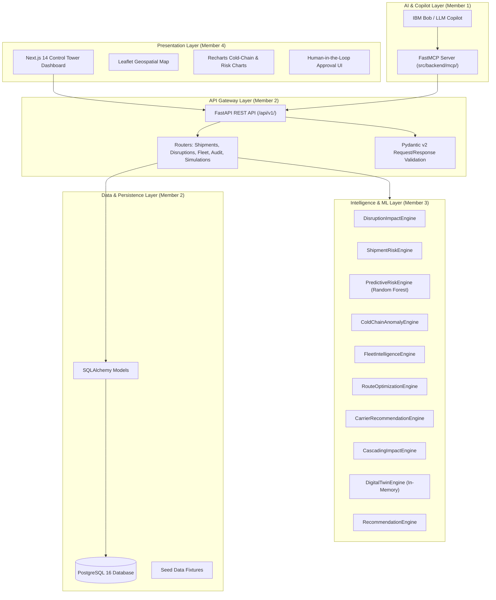
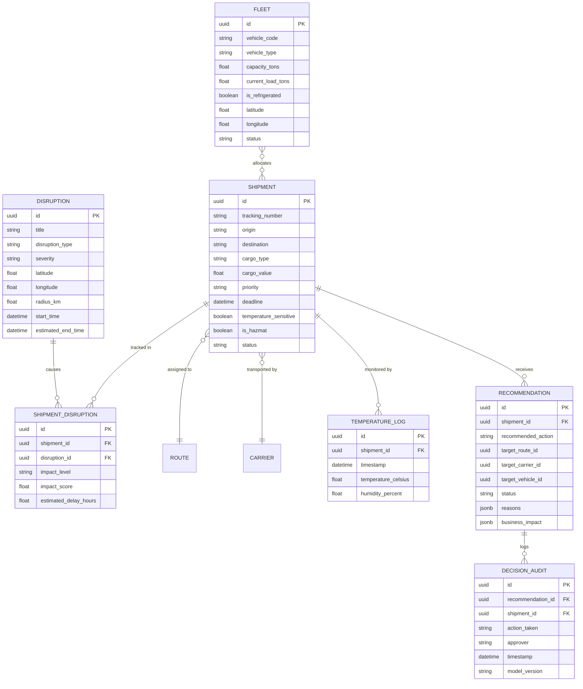
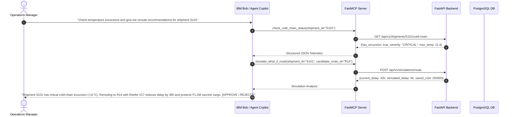

# SupplyChainOS — System Architecture & Technical Specifications

## 1. System Overview

SupplyChainOS is engineered as a decoupled, layered micro-modular architecture consisting of:
1. **PostgreSQL Database** with Async SQLAlchemy & asyncpg connection pooling.
2. **FastAPI Backend Gateway** providing schema-validated REST APIs.
3. **Pure Python Computational Engines** executing deterministic analytics, ML inference, and optimization.
4. **Model Context Protocol (MCP) Server** exposing supply chain intelligence tools to IBM Bob and AI agent copilots.
5. **Next.js 14 Control Tower Frontend** delivering real-time map visualizations and human-in-the-loop decision approval.

---

## 2. Layered Architecture Diagram

---

## 3. Database Entity Relationship Model

> [!IMPORTANT]
> The many-to-many relationship between `Shipment` and `Disruption` is maintained via `shipment_disruptions`. Never add a direct `shipment.disruption_id` column.

---

## 4. API Endpoints & Contracts Specification

| Endpoint | Method | Input Parameters | Return Schema | Target Engine |
| :--- | :--- | :--- | :--- | :--- |
| `/api/v1/health` | GET | None | `{"status": "ok"}` | System Check |
| `/api/v1/shipments` | GET | `status`, `priority`, `limit`, `offset` | `List[ShipmentResponse]` | CRUD |
| `/api/v1/shipments/{id}` | GET | `id: UUID` | `ShipmentDetailResponse` | CRUD |
| `/api/v1/disruptions` | GET | `severity`, `limit` | `List[DisruptionResponse]` | CRUD |
| `/api/v1/disruptions/{id}/impact` | GET | `id: UUID` | `DisruptionImpactReportResponse` | `DisruptionImpactEngine` |
| `/api/v1/shipments/{id}/risk` | GET | `id: UUID` | `ShipmentRiskResponse` | `ShipmentRiskEngine` |
| `/api/v1/shipments/{id}/prediction` | GET | `id: UUID` | `PredictiveRiskResponse` | `PredictiveRiskEngine` |
| `/api/v1/shipments/{id}/cold-chain` | GET | `id: UUID` | `ColdChainAnalysisResponse` | `ColdChainAnomalyEngine` |
| `/api/v1/fleet/intelligence` | GET | `min_capacity`, `is_refrigerated` | `FleetIntelligenceResponse` | `FleetIntelligenceEngine` |
| `/api/v1/simulations/route` | POST | `SimulationRequest` | `SimulationComparisonResponse` | `DigitalTwinEngine` |
| `/api/v1/recommendations` | GET | `status: Enum` | `List[RecommendationResponse]` | `RecommendationEngine` |
| `/api/v1/recommendations/{id}/approve` | POST | `DecisionNotesRequest` | `ApprovalStateResponse` | State Machine + Audit |
| `/api/v1/recommendations/{id}/reject` | POST | `RejectionReasonRequest` | `ApprovalStateResponse` | State Machine + Audit |
| `/api/v1/audit` | GET | `limit`, `offset` | `List[AuditRecordResponse]` | Compliance DB |

---

## 5. Model Context Protocol (MCP) Architecture (Member 1)

The MCP Server implements the standard protocol for AI agent tool execution:

### Registered MCP Tools:
1. `get_disruption_impact(disruption_id: str)`
2. `get_shipment_risk(shipment_id: str)`
3. `check_cold_chain_status(shipment_id: str)`
4. `get_fleet_recommendations(origin: str, destination: str, is_refrigerated: bool)`
5. `simulate_what_if_route(shipment_id: str, candidate_route_id: str)`
6. `get_recommendation_and_approve(recommendation_id: str, action: str, approver: str)`
