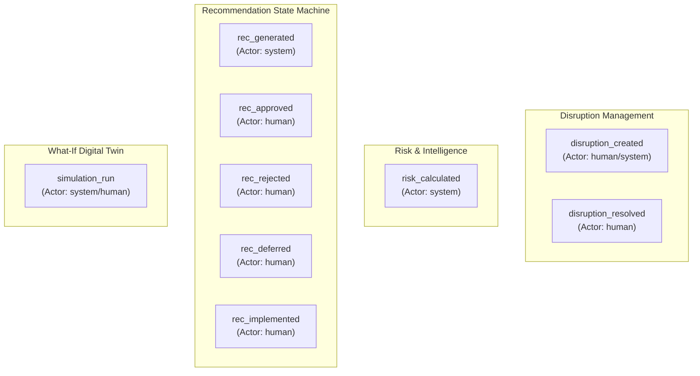
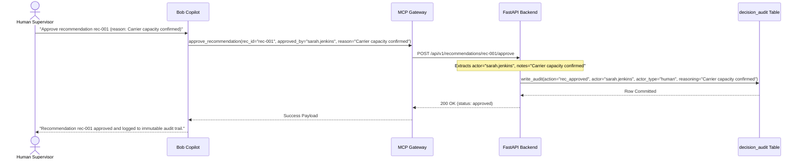

# SupplyChainOS — Decision Audit Architecture

> **Document Version**: 1.0.0  
> **Status**: ✅ IMPLEMENTED (Backend Model, Logger & Endpoints) / 📋 PLANNED (MCP/Copilot Logging)  
> **Author**: Member 1 — Enterprise Software Architect  
> **Target Audience**: Compliance Officers, Security Auditors, Backend Engineers, System Integrators  

---

## 1. Executive Summary & Purpose of the Audit Trail

In mission-critical enterprise supply chains, every operational decision carries financial, contractual, and regulatory accountability:
- When a temperature excursion occurs on pharmaceutical vaccines, FDA/EMA regulators require complete historical provenance of all actions taken.
- When high-value shipments are rerouted at substantial freight cost, financial auditors require justification of *who* authorized the deviation and *why*.
- When AI algorithms generate risk assessments, data scientists require exact snapshots of model versions and feature contributions at the moment of inference.

The **SupplyChainOS Decision Audit Trail** provides an immutable, transparent, and structured record of all risk recalculations, AI recommendation generations, human approvals/rejections, and what-if digital twin simulations.

---

## 2. Implementation Maturity Distinctions

```
┌────────────────────────────────────────────────────────────────────────┐
│                          AUDIT MATURITY TIERS                          │
├───────────────────────────────────┬────────────────────────────────────┤
│ Tier                              │ Components & Capabilities          │
├───────────────────────────────────┼────────────────────────────────────┤
│ ✅ IMPLEMENTED (MVP)              │ • PostgreSQL `decision_audit` table│
│                                   │ • Shared `write_audit()` helper    │
│                                   │ • 9 distinct auditable actions     │
│                                   │ • JSONB previous/new state diffs   │
│                                   │ • `GET /api/v1/audit` query APIs   │
│                                   │ • Application-level append-only    │
├───────────────────────────────────┼────────────────────────────────────┤
│ 📋 PLANNED (MCP / Gateway)        │ • MCP tool actor attribution       │
│                                   │ • Bob Copilot prompt correlation ID│
│                                   │ • Next.js Audit Explorer dashboard │
├───────────────────────────────────┼────────────────────────────────────┤
│ 🔮 FUTURE (Production Compliance) │ • DB-level REVOKE UPDATE/DELETE    │
│                                   │ • Cryptographic hash chaining      │
│                                   │ • WORM (Write Once Read Many) store│
└───────────────────────────────────┴────────────────────────────────────┘
```

---

## 3. Database Schema: `DecisionAudit` Model

The audit trail is persisted in the PostgreSQL `decision_audit` table (`backend/models/decision_audit.py`):

```sql
CREATE TABLE decision_audit (
    id UUID PRIMARY KEY DEFAULT gen_random_uuid(),
    entity_type VARCHAR(50) NOT NULL,
    entity_id UUID NOT NULL,
    action VARCHAR(50) NOT NULL,
    actor VARCHAR(100) NOT NULL,
    actor_type VARCHAR(20) NOT NULL,
    previous_state JSONB NULL,
    new_state JSONB NULL,
    reasoning TEXT NULL,
    metadata JSONB NULL,
    created_at TIMESTAMPTZ NOT NULL DEFAULT NOW()
);

CREATE INDEX ix_decision_audit_entity ON decision_audit(entity_type, entity_id);
CREATE INDEX ix_decision_audit_action ON decision_audit(action);
CREATE INDEX ix_decision_audit_created ON decision_audit(created_at DESC);
```

### Complete Field Specification

| Field Name | Type | Nullable | Description & Usage |
|---|---|:---:|---|
| **`id`** | `UUID` | ❌ No | Unique primary key for the audit event. |
| **`entity_type`** | `VARCHAR(50)` | ❌ No | Categorizes the entity: `"shipment"`, `"disruption"`, `"recommendation"`, `"simulation"`. |
| **`entity_id`** | `UUID` | ❌ No | Foreign identifier of the specific entity being modified or evaluated. |
| **`action`** | `VARCHAR(50)` | ❌ No | Standardized action verb (e.g. `"risk_calculated"`, `"rec_approved"`, `"simulation_run"`). |
| **`actor`** | `VARCHAR(100)`| ❌ No | Identifier of the entity executing the action: `"system"` or human operator username (e.g. `"sarah.jenkins"`). |
| **`actor_type`** | `VARCHAR(20)` | ❌ No | Origin classification: `"system"` (AI/Engine/Scheduler) or `"human"` (Operator/Supervisor). |
| **`previous_state`**| `JSONB` | ✅ Yes | Complete JSON snapshot of the entity *before* modification. `null` on initial creation. |
| **`new_state`** | `JSONB` | ✅ Yes | Complete JSON snapshot of the entity *after* modification. |
| **`reasoning`** | `TEXT` | ✅ Yes | Human-readable explanation or justification describing *why* the action occurred. |
| **`extra_metadata`**| `JSONB` | ✅ Yes | Supplementary technical context (model versions, risk scores, scenario parameters, feature weights). Column name in DB: `metadata`. |
| **`created_at`** | `TIMESTAMPTZ` | ❌ No | Server-generated immutable UTC timestamp (`func.now()`). |

---

## 4. Auditable Events & Trigger Matrix

SupplyChainOS records 9 primary operational events across the backend lifecycle:



| Action Verb | Target Entity | Actor Type | Trigger Point | Reasoning Source | Key Metadata Included |
|---|---|---|---|---|---|
| **`risk_calculated`** | `shipment` | `system` | `GET /shipments/{id}/risk` | `ShipmentRiskEngine.explanation` | `ml_score`, `combined_score`, `model_version`, `disruption_count` |
| **`disruption_created`** | `disruption` | `human` / `system`| `POST /disruptions` | Disruption title/description | `severity`, `radius_km`, `route_codes` |
| **`disruption_resolved`**| `disruption` | `human` | `PATCH /disruptions/{id}/resolve` | Operator resolution note | `resolution_time`, `active_duration_hours` |
| **`rec_generated`** | `recommendation` | `system` | `POST /recommendations/generate`| `RecommendationEngine.reason` | `disruption_id`, `priority`, `est_savings` |
| **`rec_approved`** | `recommendation` | `human` | `POST /recommendations/{id}/approve` | Mandatory Operator Notes | `approved_by`, `approved_at` |
| **`rec_rejected`** | `recommendation` | `human` | `POST /recommendations/{id}/reject` | Mandatory Operator Notes | `rejected_by`, `rejection_reason` |
| **`rec_deferred`** | `recommendation` | `human` | `POST /recommendations/{id}/defer` | Operator Deferral Notes | `deferred_until` |
| **`rec_implemented`** | `recommendation` | `human` | `POST /recommendations/{id}/implement`| Operator Dispatch Notes | `dispatched_route`, `carrier_id` |
| **`simulation_run`** | `simulation` | `system` / `human`| `POST /simulation/run` | Scenario description | `total_affected`, `value_at_risk`, `recommendation_count` |

---

## 5. Event-by-Event Payload Deep Dive

### 5.1 Recommendation Generation (`rec_generated`)
When the `RecommendationEngine` evaluates a disruption and generates candidate mitigations:
```json
{
  "entity_type": "recommendation",
  "entity_id": "a1111111-1111-1111-1111-111111111111",
  "action": "rec_generated",
  "actor": "system",
  "actor_type": "system",
  "reasoning": "Shipment TRK-1002 is rerouted via RT-CAPE because current route is blocked by 'Red Sea Security Alert' (combined risk: 0.78).",
  "previous_state": null,
  "new_state": {
    "id": "a1111111-1111-1111-1111-111111111111",
    "type": "reroute",
    "priority": "high",
    "status": "pending",
    "requires_approval": true
  },
  "metadata": {
    "disruption_id": "9b1deb4d-3b7d-4bad-9bdd-2b0d7b3dcb6d",
    "estimated_savings_usd": 12000.0,
    "delay_reduction_hours": 36.0
  }
}
```

---

### 5.2 Human Approval (`rec_approved`)
When a supervisor authorizes an action via API, Next.js UI, or Bob Copilot:
```json
{
  "entity_type": "recommendation",
  "entity_id": "a1111111-1111-1111-1111-111111111111",
  "action": "rec_approved",
  "actor": "sarah.jenkins",
  "actor_type": "human",
  "reasoning": "Capacity confirmed with Cape Express Line. Delay reduced by 36h.",
  "previous_state": {
    "id": "a1111111-1111-1111-1111-111111111111",
    "status": "pending",
    "requires_approval": true
  },
  "new_state": {
    "id": "a1111111-1111-1111-1111-111111111111",
    "status": "approved",
    "approved_by": "sarah.jenkins",
    "approved_at": "2026-09-14T20:00:00Z"
  },
  "metadata": null
}
```

---

### 5.3 What-If Simulation Run (`simulation_run`)
When the `DigitalTwinEngine` executes a non-destructive what-if scenario:
```json
{
  "entity_type": "simulation",
  "entity_id": "f5555555-5555-5555-5555-555555555555",
  "action": "simulation_run",
  "actor": "system",
  "actor_type": "system",
  "reasoning": "What-if simulation: 'Typhoon Malakas in Hong Kong' — 4 shipments affected.",
  "previous_state": null,
  "new_state": {
    "name": "Typhoon Malakas in Hong Kong",
    "disruption_type": "weather",
    "severity": "critical",
    "epicenter_lat": 22.3,
    "epicenter_lng": 114.2,
    "affected_radius_km": 350.0,
    "horizon_hours": 72
  },
  "metadata": {
    "total_affected": 4,
    "total_secondary": 1,
    "total_value_at_risk": 680000.0,
    "recommendation_count": 6
  }
}
```

---

## 6. Audit Trail Retrieval APIs

The audit router (`backend/routers/audit.py`) exposes dedicated read-only endpoints:

### 1. General Audit Query (`GET /api/v1/audit`)
- **Query Parameters**:
  - `entity_type` (optional string): Filter by `"shipment"`, `"disruption"`, `"recommendation"`, `"simulation"`.
  - `actor_type` (optional string): Filter by `"human"` or `"system"`.
  - `action` (optional string): Filter by action verb (e.g. `"rec_approved"`).
  - `limit` (optional integer, default: `500`).
- **Response**: Array of `AuditRead` records sorted by `created_at DESC`.

### 2. Entity-Specific History (`GET /api/v1/audit/{entity_type}/{entity_id}`)
- **Purpose**: Fetch the complete, chronological lifetime provenance for a specific entity (e.g., all risk recalculations for shipment `TRK-1002`).
- **Response**: Array of `AuditRead` records sorted by `created_at ASC` (earliest to latest).

---

## 7. Audit Immutability & Security Architecture

### Current Application-Level Immutability (✅ IMPLEMENTED)
1. **Zero Update/Delete Handlers**: The FastAPI codebase contains no endpoints, service methods, or SQL statements that perform `UPDATE` or `DELETE` on the `decision_audit` table.
2. **Atomic Transactional Logging**: `write_audit()` is called inside the active SQLAlchemy session before `session.commit()`. If the business action fails, the audit record rolls back; if the action commits, the audit record is permanently written.

### Future Database-Level Immutability (🔮 FUTURE)
In production compliance environments (e.g. 21 CFR Part 11 / SOC 2):
```sql
-- Database-level protection: Prevent any user from updating or deleting audit rows
REVOKE UPDATE, DELETE ON TABLE decision_audit FROM supplychainOS_app;

-- PostgreSQL Trigger to reject any modifications
CREATE OR REPLACE FUNCTION prevent_audit_tampering()
RETURNS TRIGGER AS $$
BEGIN
    RAISE EXCEPTION 'decision_audit table is strictly append-only. Modification prohibited.';
END;
$$ LANGUAGE plpgsql;

CREATE TRIGGER trg_prevent_audit_tampering
BEFORE UPDATE OR DELETE ON decision_audit
FOR EACH ROW EXECUTE FUNCTION prevent_audit_tampering();
```

---

## 8. MCP & Bob Copilot Audit Integration

When Bob Copilot invokes MCP write tools (`approve_recommendation`, `reject_recommendation`, `defer_recommendation`):



- **Non-Repudiation**: Bob Copilot cannot anonymize or omit the human approver identity. The `actor` string is permanently anchored in the audit record.
