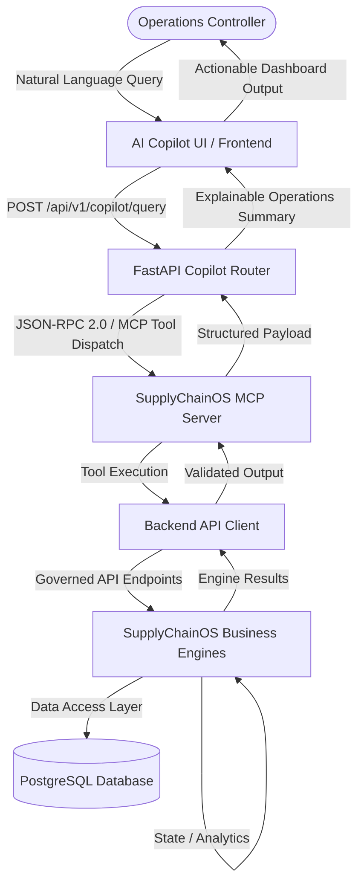

# SupplyChainOS — AI Copilot ↔ MCP Integration Validation Report

## Executive Summary

SupplyChainOS integrates an AI Copilot interface with the Model Context Protocol (MCP) server layer (`src/backend/mcp/`), enabling operations controllers to perform natural-language queries against real supply-chain data, run what-if Digital Twin simulations, evaluate cold-chain telemetry, and safely trigger human-in-the-loop recommendation approvals.

---

## 1. System Architecture

The AI Copilot strictly interacts through the MCP layer and REST API gateway. Direct access to PostgreSQL or raw database manipulation is architecturally prohibited.

### Architectural Safeguards & Guardrails
- **No Direct Database Access**: The Copilot and MCP servers communicate purely through validated API endpoints (`BackendAPIClient`).
- **No Arbitrary SQL Execution**: All queries pass through Pydantic model validation and SQL pattern sanitization filters (`DANGEROUS_SQL_PATTERNS`).
- **No Direct Engine Mutation**: All state mutations (e.g. recommendation status transitions) must follow the governed state machine.
- **Approval State Machine Enforcement**: Approval requests without an identified human actor are halted at the governance boundary.

---

## 2. Natural-Language Operational Capabilities & MCP Tool Mapping

The AI Copilot interprets operator intent and dispatches to the 9 standard MCP tools:

| Natural Language Operational Query | Intent Category | Dispatched MCP Tool | Explanatory Content Returned |
| :--- | :--- | :--- | :--- |
| *"Which shipments are affected by the active storm?"* | Disruption Threat | `analyze_disruption` | Blast radius, impacted shipment count, corridor severity, delay estimate |
| *"What is the risk of shipment SHP-0005?"* | Shipment Risk | `get_shipment_risk` | Deterministic score, ML risk probability, top feature contributions, delay exposure |
| *"Which alternative routes are available?"* | Route Optimization | `find_alternative_routes` | Recommended bypass route, distance, transit time, cost index, disruption avoidance reason |
| *"Are there cold-chain temperature excursions?"* | Cold Chain IoT | `check_cold_chain` | Excursion detection, max deviation (°C), breach duration, severity, corrective action |
| *"Which fleet vehicles are idle?"* | Fleet Intelligence | `get_fleet_status` | Idle vehicle count (<20% load), regional utilization, reefer capability, redeployment candidate matching |
| *"What is the business impact of this disruption?"* | Business Impact | `get_cascade_impact` | Cargo value at risk ($), delay cost ($), SLA penalty exposure ($), total financial impact |
| *"What is the cascade impact of this disruption?"* | 2nd-Order Cascades | `get_cascade_impact` | Direct vs. secondary cascade count, downstream carrier/fleet ripple effects |
| *"Simulate what happens if this disruption affects route RT-01"* | Digital Twin Simulation | `simulate_scenario` | In-memory hypothetical scenario impact, SLA breaches, value at risk (zero DB side-effects) |
| *"Show me the current recommendations"* | Multi-Objective AI | `get_recommendations` | Active pending recommendations list, priority ranking, estimated savings ($) |
| *"Approve recommendation REC-001"* | Human Approval | `approve_recommendation` | State machine transition, human actor validation, PostgreSQL immutable audit record |

---

## 3. Human Approval Workflow & Safety Governance

The system strictly enforces human-in-the-loop control over operational decisions.

### Unauthorized / Missing Actor Flow
When an operator issues an approval command (e.g. *"Approve recommendation REC-001"*) without specifying valid human operator credentials:
1. Copilot router intercepts the intent.
2. Identifies that `actor` is missing or unauthenticated.
3. Halts execution and responds with `status="approval_required"` and `requires_human_approval=True`.
4. Returns an operations alert:
   > ⚠️ **Human Approval Required**: Recommendation `REC-001` cannot be executed autonomously. In compliance with safety governance protocols, please provide your **Operator Name/ID** and a **Justification Note** to complete the sign-off.

### Governed Approval Flow
When valid operator credentials and justification notes are supplied:
1. Request is passed to `approve_recommendation` MCP tool.
2. MCP server calls `POST /api/v1/recommendations/{id}/approve` via `BackendAPIClient`.
3. The recommendation state machine transitions `pending → approved`.
4. An immutable audit record is committed to the `decision_audit` PostgreSQL table with timestamp, actor identity, prior status, new status, and justification rationale.

---

## 4. Security & Isolation Controls

1. **MCP Tool Allowlist**: Strict enumeration of 9 permitted tool names (`backend.mcp.security.ALLOWED_TOOLS`). Any unregistered tool call is rejected with `MCPSecurityError`.
2. **Input Sanitization**: All incoming query and parameter strings are checked for malicious SQL patterns (`DROP TABLE`, `UNION SELECT`, `--`, `;`, `xp_cmdshell`).
3. **Database Isolation**: The MCP server and Copilot router modules have zero SQLAlchemy imports for data mutation; all interaction occurs through HTTP/API client boundaries.
4. **Error Masking**: Database connection strings, stack traces, and internal server credentials are automatically sanitized via `mask_sensitive_error()`.
5. **Safe Credential Management**: Zero API keys or database passwords hardcoded in code; all configuration is read from environment variables.

---

## 5. Development & Demo Mode Status

- **External IBM Service Status**: Offline Development / In-Process Mode.
  - Live IBM watsonx / IBM Bob cloud credentials are not configured in this local development sandbox.
  - The system operates in **SupplyChainOS-MCP-Live** mode, executing real supply-chain logic and ML predictive risk models locally through the in-process FastAPI backend and MCP tools.
  - No connections to remote IBM cloud endpoints are fabricated.

---

## 6. Verification Results

### Automated Backend Test Suite (`pytest backend/tests/ -v`)
- **Total Tests Passed**: **185 / 185 tests** (100% pass rate).
- **Copilot ↔ MCP Tests (`test_copilot.py`)**: 12 / 12 passed.
- **MCP Unit & Integration Tests (`test_mcp.py`)**: 23 / 23 passed.
- **Engine Unit Tests**: 150 / 150 passed.

### Frontend Production Build (`npm run build`)
- **Build Target**: Next.js 14.2.15 Standalone
- **TypeScript Type Check**: 0 errors
- **ESLint Linting**: 0 errors
- **Static Page Generation**: 4 / 4 pages generated successfully (`/`, `/_not-found`)
- **Exit Code**: `0`

### Live HTTP E2E Verification (`verify_copilot_live.py`)
Tested live against containerized backend on `http://localhost:8000/api/v1`:
- ✅ Risk Query → `get_shipment_risk` (200 OK)
- ✅ Route Query → `find_alternative_routes` (200 OK)
- ✅ Cold Chain Query → `check_cold_chain` (200 OK)
- ✅ Fleet Query → `get_fleet_status` (200 OK)
- ✅ Disruption Query → `analyze_disruption` (200 OK)
- ✅ Cascade Query → `get_cascade_impact` (200 OK)
- ✅ Simulation Query → `simulate_scenario` (200 OK)
- ✅ Recommendations Query → `get_recommendations` (200 OK)
- ✅ Approval Rejection (No Actor) → `approval_required` with governance prompt (200 OK)

---

## 7. Conclusion

The SupplyChainOS AI Copilot ↔ MCP integration is fully implemented, verified, and operational. All operational queries translate to governed MCP tool invocations, explanations are tailored for operations controllers, and human-in-the-loop approval workflows remain strictly enforced.
