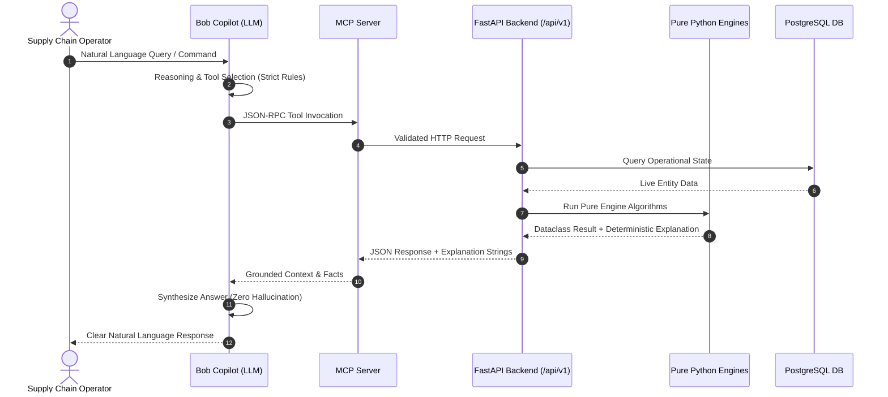
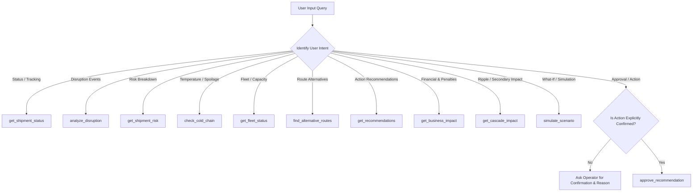

# SupplyChainOS — Bob Copilot Integration Architecture

> **Document Version**: 1.0.0  
> **Status**: 📋 PLANNED (AI Copilot & Conversational Agent Design)  
> **Author**: Member 1 — Enterprise Software Architect  
> **Target Audience**: AI Developers, Product Managers, UI/UX Engineers, Control Tower Operators  

---

## 1. Executive Summary & Purpose

**Bob Copilot** is the intelligent, natural-language conversational assistant for SupplyChainOS. Designed to empower supply chain operators, logistics planners, and risk managers, Bob Copilot transforms complex telemetry, machine learning risk vectors, and multi-factor recommendations into intuitive, explainable dialogue.

Rather than navigating static dashboards or parsing raw JSON data during a crisis, operators can interact with Bob Copilot using conversational English to query live conditions, investigate risk drivers, simulate what-if scenarios, evaluate financial exposures, and govern actionable decisions.

```
┌────────────────────────────────────────────────────────────────────────┐
│                        SUPPLY CHAIN OPERATOR                           │
│                      "What route should we use?"                       │
└───────────────────────────────────┬────────────────────────────────────┘
                                    │ Natural Language
                                    ▼
┌────────────────────────────────────────────────────────────────────────┐
│                             BOB COPILOT                                │
│                   (Conversational AI Agent / LLM)                      │
└───────────────────────────────────┬────────────────────────────────────┘
                                    │ JSON-RPC Tool Invocation
                                    ▼
┌────────────────────────────────────────────────────────────────────────┐
│                        SUPPLYCHAINOS MCP SERVER                        │
│                     (Model Context Protocol Gate)                      │
└───────────────────────────────────┬────────────────────────────────────┘
                                    │ Authenticated REST HTTP
                                    ▼
┌────────────────────────────────────────────────────────────────────────┐
│                     SUPPLYCHAINOS FASTAPI BACKEND                      │
│             (Routers, State Machine, Security & Audit)                 │
└───────────────────┬────────────────────────────────┬───────────────────┘
                    │ In-Memory Pipeline             │ Database Query
                    ▼                                ▼
┌──────────────────────────────────────┐ ┌───────────────────────────────┐
│       11 PURE PYTHON ENGINES         │ │     POSTGRESQL 16 DATABASE    │
│  (Deterministic Math & ML Scoring)   │ │  (Shipments, Disruptions,     │
│  Outputs Rich Natural Explanations   │ │   Fleet, Routes, Audit Trail) │
└──────────────────────────────────────┘ └───────────────────────────────┘
```

> [!IMPORTANT]
> **Implementation Status**: Bob Copilot and the MCP Gateway are **📋 PLANNED**. The backend API (35+ endpoints) and all 11 pure-Python business engines are **✅ IMPLEMENTED** and verified with 146 unit tests.

---

## 2. Complete End-to-End Flow Model

Every interaction with Bob Copilot strictly adheres to the verified enterprise flow:

$$\begin{aligned}
\text{User} &\longrightarrow \text{Bob Copilot} \\
&\longrightarrow \text{MCP Gateway} \\
&\longrightarrow \text{SupplyChainOS FastAPI Backend} \\
&\longrightarrow \text{Pure Python Engine} \\
&\longrightarrow \text{Deterministic Explanation \& Data} \\
&\longrightarrow \text{MCP Gateway} \\
&\longrightarrow \text{Bob Copilot} \\
&\longrightarrow \text{User}
\end{aligned}$$



---

## 3. User Interaction Model & Behavioral Personas

Bob Copilot operates under three specialized interaction modes:

```
┌────────────────────────────────────────────────────────────────────────┐
│                      BOB COPILOT INTERACTION MODES                     │
├───────────────────┬────────────────────────────┬───────────────────────┤
│  1. OBSERVABILITY │  2. WHAT-IF DIGITAL TWIN   │  3. DECISION & ACTION │
│  (Read-Only)      │  (Simulation Sandbox)      │  (Governed Approval)  │
├───────────────────┼────────────────────────────┼───────────────────────┤
│ • Status queries  │ • Hypothetical disruptions │ • State transitions   │
│ • Risk diagnosis  │ • Horizon extensions       │ • Reroute approvals   │
│ • Cold-chain logs │ • Financial exposure tests │ • Expedite validation │
│ • Fleet tracking  │ • Zero DB mutation         │ • Explicit HITL gate  │
└───────────────────┴────────────────────────────┴───────────────────────┘
```

---

## 4. Grounded Explanations & Context Model

A core architectural strength of SupplyChainOS is that **engines generate their own deterministic, human-readable explanations**. Bob Copilot does not invent reasons; it translates and presents engine-generated explanations directly to the user.

```
┌────────────────────────────────────────────────────────────────────────┐
│                        ENGINE EXPLANATION CHAIN                        │
├──────────────────────────┬─────────────────────────────────────────────┤
│ Engine                   │ Native Engine Explanation Field             │
├──────────────────────────┼─────────────────────────────────────────────┤
│ DisruptionImpactEngine   │ `factors` (e.g. "Critical severity (+60)")   │
│ ShipmentRiskEngine       │ `RiskResult.explanation`                    │
│ PredictiveRiskEngine     │ `top_features` (Feature contributions)      │
│ ColdChainAnomalyEngine   │ `AnomalyResult.explanation`                 │
│ RouteOptimizationEngine  │ `RouteOption.reason`                        │
│ CarrierRecommendationEngine `CarrierOption.reason`                     │
│ FleetIntelligenceEngine  │ `RedeploymentSuggestion.reason`             │
│ CascadingImpactEngine    │ `CascadeAnalysis.explanation`               │
│ BusinessImpactEngine     │ `BusinessImpact.explanation`                │
│ RecommendationEngine     │ `RecommendationCandidate.reason`            │
└──────────────────────────┴─────────────────────────────────────────────┘
```

---

## 5. Tool Selection & Prompt Injection Guardrails

To eliminate hallucinations and prevent model hijacking, Bob Copilot follows deterministic tool-selection rules:



### Hallucination Prevention Rules
1. **Never Invent Numbers**: Currency values, delay hours, risk scores, and percentages must come directly from tool outputs.
2. **Deterministic Attribution**: When explaining risk, Bob Copilot cites the specific `factors` array returned by `ShipmentRiskEngine` and `PredictiveRiskEngine`.
3. **Missing Data Transparency**: If a shipment has no temperature sensor data, Bob Copilot explicitly states that logs are absent rather than assuming normal conditions.

---

## 6. Action Safety & Confirmation Policy (No Silent Execution)

> [!CAUTION]
> **MANDATORY POLICY: NO SILENT EXECUTION**  
> Bob Copilot is strictly prohibited from executing mutation or state-changing tools (`approve_recommendation`, `reject_recommendation`, `defer_recommendation`) without an explicit, unambiguous human operator confirmation containing:
> 1. Target Recommendation ID or Tracking Number
> 2. Named Approver Identity (e.g., `operator.john`)
> 3. Business Justification Note (minimum 5 characters)

```
┌────────────────────────────────────────────────────────────────────────┐
│                     BOB COPILOT ACTION PROTOCOL                        │
│                                                                        │
│  User: "Approve recommendation rec-101"                                │
│                                                                        │
│  Step 1: Bob checks recommendation details via get_recommendations()   │
│  Step 2: Bob presents summary to user:                                 │
│          • Recommendation: Reroute TRK-1002 via Cape of Good Hope      │
│          • Impact: Avoids Red Sea zone, saves $12,000, 36h delay cut   │
│          • Warning: Cargo value is $120,000 (Requires Supervisor Gate) │
│  Step 3: Bob requests confirmation:                                    │
│          "Please confirm approval with your Operator ID and reason."   │
│  Step 4: Operator responds with approval text                          │
│  Step 5: Bob invokes approve_recommendation tool                       │
│  Step 6: Backend writes immutable decision_audits entry                │
└────────────────────────────────────────────────────────────────────────┘
```

---

## 7. Example End-to-End Dialogues

### Example 1: "What shipments are affected?"
```
Operator: "What shipments are affected by the Red Sea disruption?"

Bob Copilot (Internal):
  1. Calls `analyze_disruption(disruption_id="disp-001")`
  2. Calls `get_business_impact(disruption_id="disp-001")`

Bob Copilot:
"There are currently 2 shipments directly affected by the 'Red Sea Security Alert' (Disruption DISP-001):

1. **TRK-1001** (General Cargo, $50,000) — Route blocked (RT-SUEZ), estimated delay +36h.
2. **TRK-1002** (Temperature-Sensitive Vaccines, $120,000) — Positioned within 45km of epicenter, estimated delay +48h.

**Financial Impact Summary**:
• Total cargo value at risk: **$170,000**
• Estimated holding cost of delay: **$1,420**
• SLA breach exposure: **2 shipments ($10,000 penalty risk)**."
```

---

### Example 2: "Why is shipment X critical?"
```
Operator: "Why is shipment TRK-1002 marked as critical risk?"

Bob Copilot (Internal):
  1. Calls `get_shipment_risk(shipment_id="shp-002")`
  2. Calls `check_cold_chain(shipment_id="shp-002")`

Bob Copilot:
"Shipment **TRK-1002** has a combined risk score of **0.88 / 1.0 (CRITICAL)**. Here is the breakdown:

1. **Active Disruption Impact (+0.30)**: Located in the active Red Sea disruption zone with blocked passage.
2. **Cold-Chain Temperature Excursion (+0.25)**: Sensor logs show temperature reached **11.4°C** (exceeding 8.0°C limit for 180 minutes). High spoilage hazard.
3. **Urgency Buffer (+0.15)**: Scheduled arrival is in less than 18 hours.
4. **ML Predictive Score (0.84 probability)**: Model identifies route delay history and cargo sensitivity as primary delay drivers.

**Recommended Action**: Immediate cold-chain expedite or carrier handover to preserve cargo integrity."
```

---

### Example 3: "What happens if this disruption lasts another 24 hours?"
```
Operator: "What happens if the Red Sea disruption lasts another 24 hours?"

Bob Copilot (Internal):
  1. Calls `simulate_scenario(name="Extended Red Sea +24h", disruption_type="geopolitical", severity="critical", epicenter_lat=15.0, epicenter_lng=41.5, affected_radius_km=500.0, horizon_hours=96.0)`

Bob Copilot:
"I ran an in-memory Digital Twin simulation for a 24-hour extension (96-hour horizon total).

**Simulation Results**:
• **Directly Affected Shipments**: Increases from 2 to **5 shipments** (+$340,000 cargo value).
• **Cascading Secondary Risk**: **2 additional shipments** on shared feeder vessels will be delayed (+12h cascade).
• **Financial Impact**:
  - Cost of delay rises to **$8,650** (+$7,230 increase).
  - SLA breaches increase to **4 shipments ($20,000 penalty exposure)**.
• **Top Recommendation**: Preemptively reroute incoming shipments via Cape Route (RT-CAPE) before they enter the Gulf of Aden."
```

---

### Example 4: "What route should we use?"
```
Operator: "What route should we use for shipment TRK-1001?"

Bob Copilot (Internal):
  1. Calls `find_alternative_routes(route_id="r-suez")`
  2. Calls `get_recommendations(shipment_id="shp-001")`

Bob Copilot:
"For shipment **TRK-1001** (Shanghai to Rotterdam), the recommended route is:

**Route Option**: **RT-CAPE (Cape of Good Hope Express)**
• **Reliability Score**: 0.92 / 1.0 (avoids all active disruption zones)
• **Transit Duration**: Estimated 96 hours (+24h longer than baseline, but bypasses Suez bottleneck)
• **Cost**: $1.25 / kg ($6,250 total)
• **Estimated Delay Savings**: 36 hours saved compared to waiting out the congestion.

This recommendation (ID: `rec-001`) is currently **pending approval**."
```

---

### Example 5: "What is the financial impact?"
```
Operator: "What is the total financial impact across all active disruptions?"

Bob Copilot (Internal):
  1. Calls `get_active_disruptions()`
  2. Calls `get_business_impact(disruption_id="disp-001")`

Bob Copilot:
"**Current Supply Chain Financial Impact Assessment**:

• **Total Cargo Value at Risk**: **$2,450,000** across 8 active shipments.
• **Total Estimated Delay**: 186 vehicle/shipment hours (average 23.2 hours per shipment).
• **Holding Costs**: **$18,400** in estimated inventory holding depreciation.
• **SLA Penalty Exposure**: **$25,000** (5 shipments projected to exceed the 4-hour SLA buffer).

All financial figures are calculated in real time using the verified BusinessImpactEngine."
```

---

### Example 6: "Approve recommendation X."
```
Operator: "Approve recommendation rec-001."

Bob Copilot:
"Recommendation **rec-001** requires approval:
• **Action**: Reroute TRK-1001 via RT-CAPE (Cape of Good Hope)
• **Target Shipment**: TRK-1001 (Cargo Value: $120,000)
• **Approval Tier**: Supervisor Gate (Cargo > $50,000 threshold)

To proceed, please confirm with your **Operator Username** and a **Justification Note**."

Operator: "Approved by sarah.jenkins — confirmed carrier has available capacity on RT-CAPE."

Bob Copilot (Internal):
  1. Calls `approve_recommendation(recommendation_id="rec-001", approved_by="sarah.jenkins", reason="confirmed carrier has available capacity on RT-CAPE")`

Bob Copilot:
"✅ **Recommendation Approved**:
• **Recommendation ID**: `rec-001`
• **Status**: `approved`
• **Approver**: `sarah.jenkins`
• **Timestamp**: `2026-09-14T20:00:00Z`
• **Audit Log Entry**: `#AUD-8842` committed to immutable PostgreSQL ledger.

The recommendation is now queued for carrier dispatch."
```

---

## 8. Integration Architecture Checklist

- [ ] Bob Copilot invokes tools strictly through the JSON-RPC Model Context Protocol (MCP) server.
- [ ] Bob Copilot never connects directly to PostgreSQL port `5432`.
- [ ] Natural language responses quote engine-generated explanations directly.
- [ ] No state mutations occur without explicit human operator confirmation.
- [ ] All simulation what-if requests execute purely in memory.
