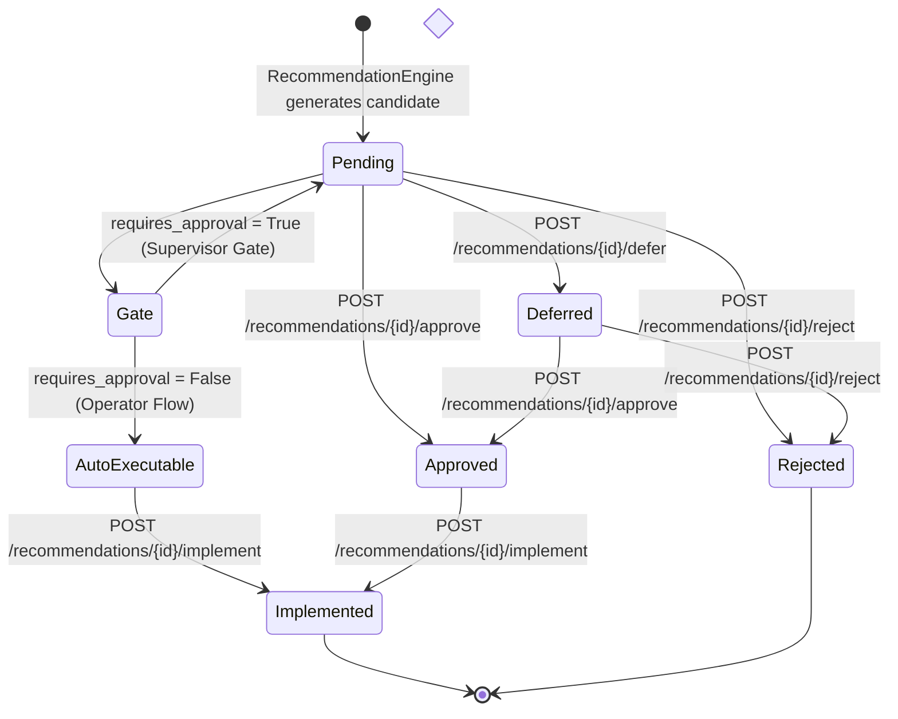
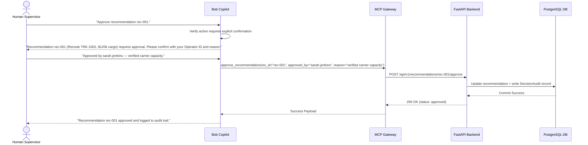

# SupplyChainOS — Human-in-the-Loop (HITL) Governance & Approval Model

> **Document Version**: 1.0.0  
> **Status**: ✅ IMPLEMENTED (Backend State Machine & Audit) / 📋 PLANNED (MCP & Copilot Approval Gate)  
> **Author**: Member 1 — Enterprise Software Architect  
> **Target Audience**: Compliance Officers, Supply Chain Directors, Backend Engineers, Frontend Developers  

---

## 1. Executive Summary & Purpose

In global supply chain management, operational decisions carry severe financial, legal, and contractual consequences:
- Diverting a container vessel incurs tens of thousands of dollars in fuel and port fees.
- Switching to an expedited air carrier can cost 5× baseline freight rates.
- Mismanaging a cold-chain excursion risks regulatory quarantine or total loss of pharmaceutical inventory.

Autonomous AI agents must **never** be permitted to execute high-stakes operational mutations without verified human authorization. **SupplyChainOS** enforces a formal **Human-in-the-Loop (HITL)** governance framework. AI models and pure engines diagnose, score, and recommend mitigations, but execution authority remains strictly with certified human operators.

---

## 2. Implementation Maturity Distinctions

```
┌────────────────────────────────────────────────────────────────────────┐
│                        GOVERNANCE MATURITY TIERS                       │
├───────────────────────────────────┬────────────────────────────────────┤
│ Tier                              │ Components & Features              │
├───────────────────────────────────┼────────────────────────────────────┤
│ ✅ IMPLEMENTED (MVP)              │ • 5-state recommendation machine   │
│                                   │ • 6 rule-based approval triggers   │
│                                   │ • ApprovalAction payload (actor)   │
│                                   │ • 4 REST endpoints (/approve, etc) │
│                                   │ • Immutable decision_audits ledger │
├───────────────────────────────────┼────────────────────────────────────┤
│ 📋 PLANNED (Gateway & UI)         │ • MCP tool approve_recommendation  │
│                                   │ • Bob Copilot interactive confirm  │
│                                   │ • Next.js Control Tower action UI  │
├───────────────────────────────────┼────────────────────────────────────┤
│ 🔮 FUTURE (Enterprise Scale)      │ • Multi-signature dual-approval    │
│                                   │ • Strict OAuth2/OIDC RBAC roles    │
│                                   │ • Automatic escalation timeouts    │
└───────────────────────────────────┴────────────────────────────────────┘
```

---

## 3. Recommendation Lifecycle & State Machine

Every recommendation generated by the `RecommendationEngine` traverses an explicit, deterministic state machine enforced in `backend/routers/recommendations.py`:



### State Definitions & Valid Transitions

| Status | Meaning | Valid Next Transitions | HTTP Endpoint |
|---|---|---|---|
| `pending` | Newly generated by RecommendationEngine; awaiting review | `approved`, `rejected`, `deferred`, `implemented` (if `requires_approval=False`) | `POST /api/v1/recommendations/generate` |
| `approved` | Certified by human supervisor; ready for execution | `implemented` | `POST /api/v1/recommendations/{id}/approve` |
| `rejected` | Declined by human supervisor; reason recorded | Terminal State (`*`) | `POST /api/v1/recommendations/{id}/reject` |
| `deferred` | Postponed pending further monitoring/information | `approved`, `rejected` | `POST /api/v1/recommendations/{id}/defer` |
| `implemented` | Action successfully dispatched to carrier/fleet | Terminal State (`*`) | `POST /api/v1/recommendations/{id}/implement` |

> [!WARNING]
> **State Machine Guard**: If a recommendation has `requires_approval=True`, calling `POST /api/v1/recommendations/{id}/implement` before approval will return **HTTP 409 Conflict**:
> ```json
> { "detail": "This recommendation requires approval before implementation. Current status: 'pending'" }
> ```

---

## 4. Deterministic Approval Triggers

A recommendation is automatically flagged with `requires_approval = True` if **any** of the following 6 conditions are met:

```
┌────────────────────────────────────────────────────────────────────────┐
│                      APPROVAL TRIGGER MATRIX                           │
├─────────────────────────┬───────────────────┬──────────────────────────┤
│ Trigger Condition       │ Threshold / Rule  │ Rationale                │
├─────────────────────────┼───────────────────┼──────────────────────────┤
│ 1. High-Value Cargo     │ Value > $50,000   │ Major financial liability│
│ 2. Critical Disruption  │ Severity=Critical │ High systemic volatility │
│ 3. Cold-Chain Expedite  │ Type="expedite"   │ Premium air/express costs│
│ 4. Fleet Redeployment   │ Type="fleet_redeploy" Physical asset transfer│
│ 5. Carrier Cost Surge   │ Cost Index > +20% │ Budget/margin protection │
│ 6. Cascade Risk Scale   │ Secondary > $50k  │ Systemic ripple impact   │
└─────────────────────────┴───────────────────┴──────────────────────────┘
```

1. **High-Value Cargo Exposure**: `cargo_value_usd > settings.approval_threshold_usd` (Default: `$50,000.0`). High-value assets cannot be rerouted without supervisor sign-off.
2. **Critical Disruption Severity**: Disruption has `severity == "critical"`. Dynamic environmental chaos requires strategic human judgment.
3. **Cold-Chain Expediting**: Recommendations of type `expedite` triggered by active temperature excursions always require approval due to premium logistics fees.
4. **Fleet Redeployment**: Recommendations of type `fleet_redeploy` always require approval because physical fleet vehicles cannot be reassigned without fleet manager consent.
5. **Carrier Cost Surge Threshold**: Carrier switching recommendations where alternative carrier cost index exceeds current carrier cost by more than 20% (`best_carrier.cost_index > current_carrier.cost_index * 1.20`).
6. **Cascading Ripple Escalation**: System-wide `escalate` recommendations where total secondary cargo value at risk exceeds `$50,000.0`.

---

## 5. Actor Authorization & Who Can Approve

### Current MVP Implementation (✅ IMPLEMENTED)
- Actor identity is transmitted in the request payload:
  ```json
  {
    "actor": "operator.sarah",
    "notes": "Approved reroute via Cape of Good Hope per risk protocol."
  }
  ```
- The backend verifies `actor` is present, records the actor identity in `recommendation.approved_by` and `recommendation.approved_at`, and logs an immutable audit event with `actor_type="human"`.

### Future Role-Based Authorization (🔮 FUTURE)
In production enterprise deployment, role permissions will be validated against JWT tokens:

| Enterprise Role | Permissions |
|---|---|
| **Control Tower Viewer** | Read-only inspection of shipments, disruptions, and recommendations |
| **Logistics Operator** | Can defer recommendations; can implement `requires_approval=False` actions |
| **Supply Chain Supervisor** | Can approve/reject `requires_approval=True` recommendations up to $250k |
| **Executive Director** | Dual-signature authorization required for actions exceeding $250k |

---

## 6. Detailed API Payloads & State Transitions

### 6.1 Approve Recommendation (`POST /recommendations/{id}/approve`)
- **Preconditions**: Status must be `pending` or `deferred`.
- **Request Payload**:
```json
{
  "actor": "sarah.jenkins",
  "notes": "Capacity confirmed with Cape Express Line. Delay reduced by 36h."
}
```
- **Response Payload (HTTP 200 OK)**:
```json
{
  "id": "a1111111-1111-1111-1111-111111111111",
  "shipment_id": "e4eaaaf2-d142-11e1-b3e4-080027620cdd",
  "disruption_id": "9b1deb4d-3b7d-4bad-9bdd-2b0d7b3dcb6d",
  "type": "reroute",
  "priority": "high",
  "title": "Reroute TRK-1002 via RT-CAPE",
  "reason": "Shipment TRK-1002 is rerouted via RT-CAPE because current route is blocked by 'Red Sea Threat'.",
  "requires_approval": true,
  "status": "approved",
  "approved_by": "sarah.jenkins",
  "approved_at": "2026-09-14T20:00:00Z",
  "created_at": "2026-09-14T19:40:00Z",
  "updated_at": "2026-09-14T20:00:00Z"
}
```

---

### 6.2 Reject Recommendation (`POST /recommendations/{id}/reject`)
- **Preconditions**: Status must be `pending` or `deferred`.
- **Request Payload**:
```json
{
  "actor": "sarah.jenkins",
  "notes": "Rejected: Customer requested holding cargo at origin hub instead."
}
```
- **Response Payload (HTTP 200 OK)**: `status = "rejected"`.

---

### 6.3 Defer Recommendation (`POST /recommendations/{id}/defer`)
- **Preconditions**: Status must be `pending`.
- **Request Payload**:
```json
{
  "actor": "sarah.jenkins",
  "notes": "Deferred: Waiting for 18:00 UTC weather telemetry update."
}
```
- **Response Payload (HTTP 200 OK)**: `status = "deferred"`.

---

### 6.4 Implement Recommendation (`POST /recommendations/{id}/implement`)
- **Preconditions**:
  - If `requires_approval=True`: Status **must** be `approved`.
  - If `requires_approval=False`: Status may be `pending` or `approved`.
- **Request Payload**:
```json
{
  "actor": "sarah.jenkins",
  "notes": "Dispatched new route coordinates to vessel navigation system."
}
```
- **Response Payload (HTTP 200 OK)**: `status = "implemented"`.

---

## 7. Audit Trail & Non-Repudiation Logging

Every state transition automatically executes `backend.utils.audit.write_audit()` within the same database transaction:

```
┌────────────────────────────────────────────────────────────────────────┐
│                        IMMUTABLE AUDIT RECORD                          │
├───────────────────┬────────────────────────────────────────────────────┤
│ Field             │ Committed Value                                    │
├───────────────────┼────────────────────────────────────────────────────┤
│ id                │ UUIDv4                                             │
│ entity_type       │ "recommendation"                                   │
│ entity_id         │ a1111111-1111-1111-1111-111111111111               │
│ action            │ "rec_approved"                                     │
│ actor             │ "sarah.jenkins"                                    │
│ actor_type        │ "human"                                            │
│ reasoning         │ "Capacity confirmed with Cape Express Line..."     │
│ previous_state    │ {"status": "pending", "requires_approval": true}   │
│ new_state         │ {"status": "approved", "approved_by": "sarah..."}  │
│ created_at        │ 2026-09-14T20:00:00Z (UTC Immutable)               │
└───────────────────┴────────────────────────────────────────────────────┘
```

---

## 8. Multi-Channel Approval Workflows

### 8.1 Bob Copilot / MCP Approval Flow (📋 PLANNED)


### 8.2 Frontend Control Tower Action Flow (📋 PLANNED)
In the Next.js Control Tower dashboard:
1. Operator navigates to the **Recommendations Queue**.
2. High-risk items display an amber badge: `Requires Supervisor Approval`.
3. Clicking **Approve** opens a modal enforcing a mandatory **Actor Name** and **Reasoning Note** textarea.
4. Submission executes `POST /api/v1/recommendations/{id}/approve` and immediately updates the UI badge to `Approved` with a green checkmark.

---

## 9. Comprehensive End-to-End Approval Scenario

### Scenario: Pharmaceutical Cold-Chain Excursion during Red Sea Bottleneck
1. **Initial Event**: Shipment `TRK-1002` (carrying $120,000 of temperature-sensitive vaccines) enters the Red Sea zone during a critical security disruption.
2. **Anomaly Detected**: Refrigeration unit fails; temperature reaches 11.4°C (exceeding 8.0°C limit for 180 minutes). `ColdChainAnomalyEngine` flags `CRITICAL`.
3. **Recommendation Generated**: `RecommendationEngine` evaluates `combined_risk = 0.88` and generates `type="expedite"`. Because `cargo_value > $50,000` and `type="expedite"`, the engine sets `requires_approval = True`.
4. **Autonomous Execution Blocked**: Carrier dispatch automation cannot trigger while status is `pending`.
5. **Supervisor Review**: Supervisor Sarah logs into the Control Tower, reviews the temperature deviation logs, and verifies that alternative air charter is available.
6. **Approval Executed**: Sarah approves the recommendation with notes *"Charter flight booked via Dubai hub"*.
7. **Implementation**: Status moves to `approved`, then `implemented`. Full audit record committed with Sarah's notes, providing complete regulatory compliance for FDA/EMA audits.
