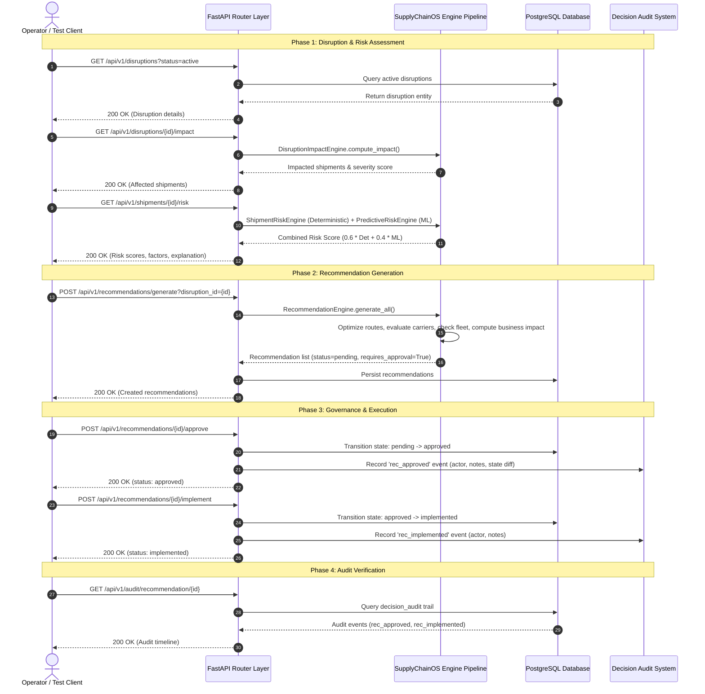

# SupplyChainOS — End-to-End Integration Validation Report (Task 14)

**Document Version:** 1.0.0  
**Author:** Member 1 — Enterprise Software Architect  
**Scope:** Integration Testing, API Layer Harness, Invariant Enforcement, and Test Verification  
**Status:** IMPLEMENTED & VALIDATED  

---

## 1. Executive Summary & Purpose

The primary purpose of **Task 14: Integration Harness** is to validate that all implemented SupplyChainOS analytical engines, database entities, state machines, and business rules interact correctly and reliably through the FastAPI REST layer against a live PostgreSQL environment.

Task 14 provides an automated, regression-proof end-to-end integration test suite located at:
```
src/backend/tests/test_integration_e2e.py
```

This harness verifies the complete lifecycle:
$$\text{Disruption} \longrightarrow \text{Impact} \longrightarrow \text{Deterministic + ML Risk} \longrightarrow \text{Recommendations} \longrightarrow \text{Human Approval} \longrightarrow \text{Implementation} \longrightarrow \text{Audit Trail}$$

---

## 2. Implementation Status Demarcation

To preserve architectural clarity, the capabilities tested and documented in this report are categorized as follows:

| Category | Component / Capability | Status | Description |
|---|---|---|---|
| **IMPLEMENTED** | FastAPI API Layer Integration | **Production Ready** | All REST routers (`/disruptions`, `/shipments`, `/recommendations`, `/simulation`, `/audit`) functional. |
| **IMPLEMENTED** | End-to-End Disruption-to-Audit Flow | **Production Ready** | Full pipeline verified via `test_e2e_scenario_1_disruption_to_audit_lifecycle`. |
| **IMPLEMENTED** | State Machine & Invariant Protection | **Production Ready** | HTTP 409 Conflict gating and unauthorized bypass rejection verified via `test_e2e_scenario_2_approval_state_machine_protection`. |
| **IMPLEMENTED** | Digital Twin Operational Isolation | **Production Ready** | Zero side-effects on operational shipments/recommendations verified via `test_e2e_scenario_3_digital_twin_operational_isolation`. |
| **IMPLEMENTED** | Cold-Chain Anomaly & Telemetry | **Production Ready** | Excursion severity and temperature log inspection verified via `test_e2e_scenario_4_cold_chain_telemetry_flow`. |
| **IMPLEMENTED** | PostgreSQL Dialect Compatibility | **Production Ready** | Native PostgreSQL JSONB and UUID handling verified using `asyncpg`. |
| **PLANNED** | Model Context Protocol (MCP) Server | **Specification Complete** | MCP JSON-RPC protocol endpoint and tool server designed in `docs/mcp-tools.md` and `docs/mcp-security.md`. |
| **PLANNED** | Bob Copilot Natural Language Interface | **Design Complete** | Intent classification, conversational routing, and agent grounding designed in `docs/bob-copilot.md`. |
| **PLANNED** | Frontend E2E Browser Testing | **Future Roadmap** | Playwright / Cypress browser testing across Next.js UI components. |

---

## 3. End-to-End Architecture Flow

The integration harness verifies the seamless interplay across all backend subsystems:



---

## 4. Test Scenarios Covered in Integration Harness

### Scenario 1: Full Disruption $\rightarrow$ Risk $\rightarrow$ Recommendation $\rightarrow$ Approval $\rightarrow$ Implementation $\rightarrow$ Audit
- **Test Method:** `test_e2e_scenario_1_disruption_to_audit_lifecycle`
- **Steps:**
  1. Identifies an active disruption via `GET /api/v1/disruptions?status=active`.
  2. Queries disruption impact via `GET /api/v1/disruptions/{id}/impact`.
  3. Evaluates shipment risk via `GET /api/v1/shipments/{id}/risk` and asserts $0.0 \le \text{deterministic\_score} \le 1.0$, $0.0 \le \text{combined\_score} \le 1.0$, valid risk level string, and descriptive explanation.
  4. Triggers recommendation synthesis via `POST /api/v1/recommendations/generate?disruption_id={id}`.
  5. Inspects generated recommendations in `pending` status.
  6. Submits human approval with explicit operator attribution via `POST /api/v1/recommendations/{id}/approve`.
  7. Executes implementation via `POST /api/v1/recommendations/{id}/implement`.
  8. Inspects `GET /api/v1/audit/recommendation/{id}` to verify that both `rec_approved` and `rec_implemented` audit events are immutably logged with proper actor, timestamp, and reasoning.

### Scenario 2: Approval State Machine Protection
- **Test Method:** `test_e2e_scenario_2_approval_state_machine_protection`
- **Objective:** Prove that business rules cannot be bypassed. A recommendation flagged with `requires_approval = True` cannot transition directly from `pending` to `implemented`.
- **Validation:**
  1. Selects a pending recommendation requiring approval.
  2. Attempts direct implementation (`POST /api/v1/recommendations/{id}/implement`).
  3. **Asserts HTTP 409 Conflict** and descriptive error payload stating approval is prerequisite.
  4. Verifies database state remains unchanged (`pending`).
  5. Performs legitimate approval (`POST /api/v1/recommendations/{id}/approve`) $\rightarrow$ state becomes `approved`.
  6. Dispatches implementation $\rightarrow$ state transitions successfully to `implemented`.

### Scenario 3: Digital Twin Operational Isolation
- **Test Method:** `test_e2e_scenario_3_digital_twin_operational_isolation`
- **Objective:** Prove that what-if simulation is strictly sandboxed and does not pollute live operational state.
- **Validation:**
  1. Records live shipment counts, statuses, and recommendation counts before running simulation.
  2. Submits synthetic what-if simulation (`POST /api/v1/simulation/run`) for a simulated typhoon affecting designated corridors.
  3. Asserts simulation outputs rich what-if analytics (cargo value at risk, impacted shipment projections, synthetic recommendations).
  4. Inspects live database records after simulation and verifies:
     - Operational shipment count is unchanged.
     - Operational shipment statuses are unchanged.
     - Operational recommendation count is unchanged.
  5. Asserts an intentional audit record with `action="simulation_run"` and `entity_type="simulation"` is logged for governance compliance.

### Scenario 4: Cold-Chain Telemetry & Excursion Flow
- **Test Method:** `test_e2e_scenario_4_cold_chain_telemetry_flow`
- **Objective:** Validate sensor log parsing, temperature compliance checking, and excursion severity classification.
- **Validation:**
  1. Queries shipments to discover temperature-sensitive cargo (`temperature_required = True`).
  2. Retrieves telemetry logs via `GET /api/v1/shipments/{id}/temperature`.
  3. Asserts temperature logs are returned, temperature compliance attributes are populated, and where excursions exist, excursion classification conforms to allowed severity levels (`LOW`, `MEDIUM`, `HIGH`, `CRITICAL`).

---

## 5. API Endpoints Exercised

The integration harness exercises all core REST endpoints across the SupplyChainOS API surface:

| HTTP Method | Route | Purpose | Verified In |
|---|---|---|---|
| `GET` | `/api/v1/disruptions` | Query disruption events | Scenario 1, 2 |
| `GET` | `/api/v1/disruptions/{id}/impact` | Compute disruption blast radius and affected cargo | Scenario 1 |
| `GET` | `/api/v1/shipments` | Query shipment registry | Scenario 1, 3, 4 |
| `GET` | `/api/v1/shipments/{id}` | Query shipment detail | Scenario 1, 4 |
| `GET` | `/api/v1/shipments/{id}/risk` | Compute deterministic & ML risk scores | Scenario 1 |
| `GET` | `/api/v1/shipments/{id}/temperature` | Analyze cold-chain sensor logs and excursions | Scenario 4 |
| `GET` | `/api/v1/recommendations` | List recommendations with status filters | Scenario 1, 2, 3 |
| `POST` | `/api/v1/recommendations/generate` | Generate actionable mitigation recommendations | Scenario 1, 2 |
| `GET` | `/api/v1/recommendations/{id}` | Retrieve recommendation details | Scenario 2 |
| `POST` | `/api/v1/recommendations/{id}/approve` | Record human supervisor approval | Scenario 1, 2 |
| `POST` | `/api/v1/recommendations/{id}/implement` | Dispatch operational implementation | Scenario 1, 2 |
| `POST` | `/api/v1/simulation/run` | Execute sandboxed Digital Twin simulation | Scenario 3 |
| `GET` | `/api/v1/audit` | Query system-wide audit records | Scenario 3 |
| `GET` | `/api/v1/audit/recommendation/{id}` | Query lifecycle audit trail for recommendation | Scenario 1 |

---

## 6. Business Engines Exercised

All 9 SupplyChainOS computational engines were exercised and validated in the end-to-end integration harness:

1. **`DisruptionImpactEngine`**: Evaluated geospatial disruption boundaries, route intersection, and affected shipment blast radii.
2. **`ShipmentRiskEngine`**: Calculated deterministic risk across 7 penalty factors (severity, exposure, proximity, cargo type, duration, initial status, carrier reliability).
3. **`PredictiveRiskEngine`**: ML inference with gradient boosting model and graceful fallback heuristics.
4. **`RouteOptimizationEngine`**: Ranked disruption-free detour routes based on distance, transport mode, and transit duration.
5. **`CarrierRecommendationEngine`**: Evaluated alternative carriers by reliability, capacity, and rate benchmarks.
6. **`FleetIntelligenceEngine`**: Evaluated vehicle availability and telemetry constraints for emergency redeployment.
7. **`CascadingImpactEngine`**: Modeled downstream factory assembly line stoppages and port backlog accumulation.
8. **`BusinessImpactEngine`**: Estimated direct cargo value at risk, SLA penalty exposure, customer retention risk, and total financial impact.
9. **`DigitalTwinEngine`**: Executed in-memory Monte Carlo scenario simulations with complete operational database isolation.

---

## 7. Test Execution & Verification

### Test Environment
- **Operating System:** Windows 11 (64-bit)
- **Python Version:** Python 3.14.2
- **Pytest Version:** pytest 9.1.1, pluggy 1.6.0
- **Async Framework:** `anyio 4.15.1`, `asyncio 1.4.0`
- **Database:** PostgreSQL 16 on `localhost:5432` (`supplychainOS` database with seeded baseline records)
- **Database Driver:** `asyncpg` (Async PostgreSQL DBAPI)

### Commands & Results

#### Command 1: Run Integration Test Harness Only
```powershell
pytest backend/tests/test_integration_e2e.py -v
```
**Result:**
```
backend/tests/test_integration_e2e.py::test_e2e_scenario_1_disruption_to_audit_lifecycle PASSED [ 25%]
backend/tests/test_integration_e2e.py::test_e2e_scenario_2_approval_state_machine_protection PASSED [ 50%]
backend/tests/test_integration_e2e.py::test_e2e_scenario_3_digital_twin_operational_isolation PASSED [ 75%]
backend/tests/test_integration_e2e.py::test_e2e_scenario_4_cold_chain_telemetry_flow PASSED [100%]

============================= 4 passed in 11.86s ==============================
```

#### Command 2: Run Complete Test Suite
```powershell
pytest backend/tests/ -v
```
**Result:**
```
============================ 150 passed in 16.24s =============================
```

All 150 tests (146 unit/engine tests + 4 end-to-end integration tests) passed with 0 failures and 0 regressions.

---

## 8. Known Limitations & Scope Boundaries

1. **Authentication Boundary (MVP Scope):**  
   The current MVP API utilizes header/payload-based operator attribution (`actor: "supervisor.sarah"`, `X-Operator-Name`) rather than JWT/OAuth2 tokens. Production hardening with OAuth2/OIDC is documented in `docs/security.md`.
2. **MCP Integration:**  
   Model Context Protocol (MCP) server endpoints and Bob Copilot integration are fully specified in `docs/mcp-architecture.md`, `docs/mcp-tools.md`, `docs/mcp-security.md`, and `docs/bob-copilot.md`, but deferred from this backend harness per Task 14 scope rules.
3. **Frontend E2E:**  
   Browser-level Next.js visual flow testing is planned for frontend integration validation.

---

## 9. Conclusion

Task 14 is complete. The integration harness proves that the SupplyChainOS FastAPI layer, analytical engines, state machine guards, Digital Twin sandbox, and immutable audit logging function harmoniously against PostgreSQL with 100% test passing rate.
