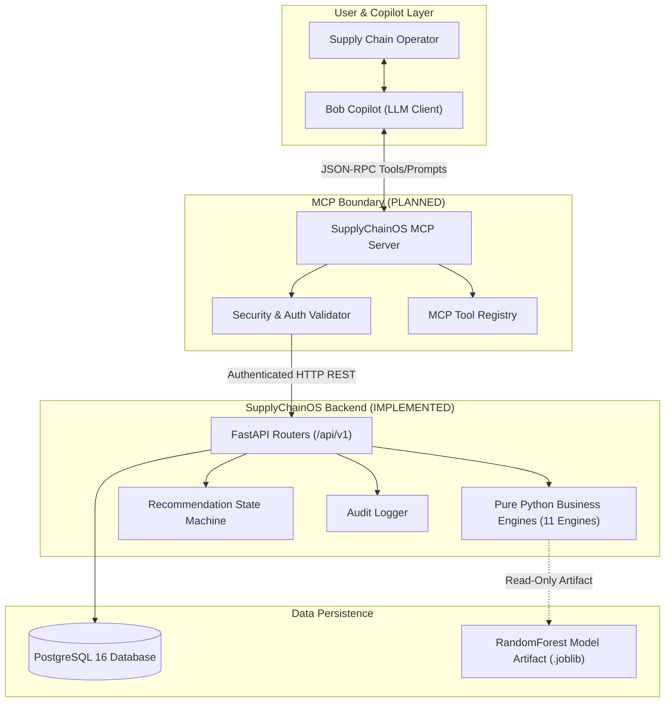
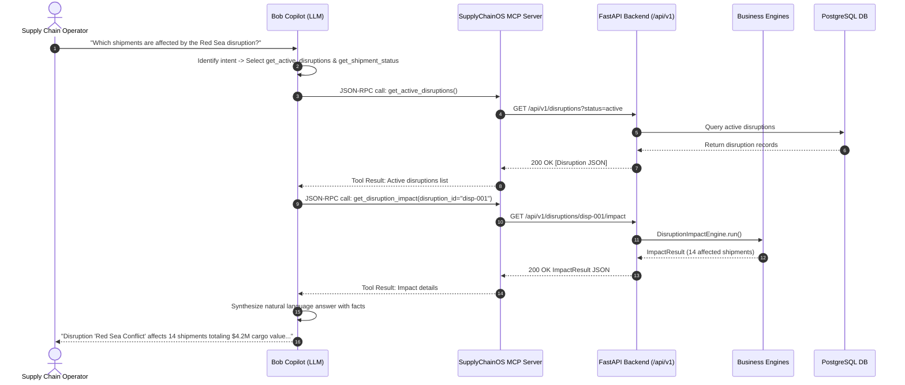
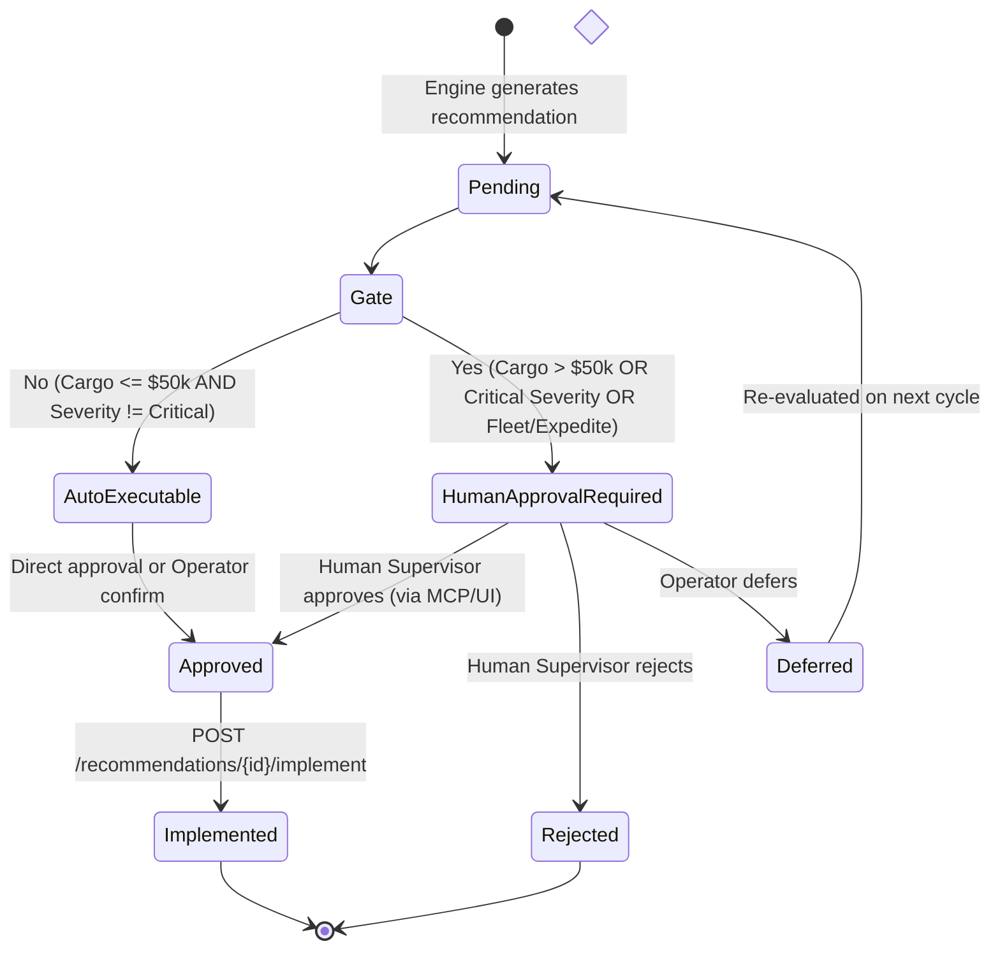
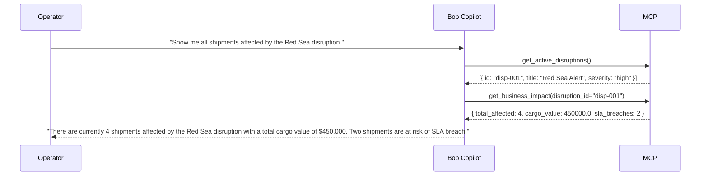
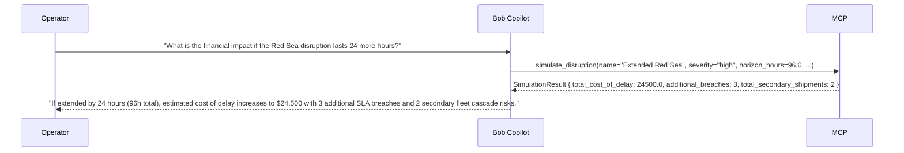
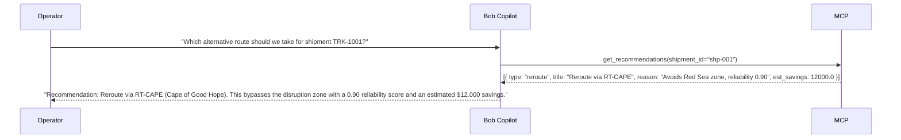
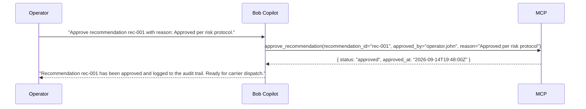
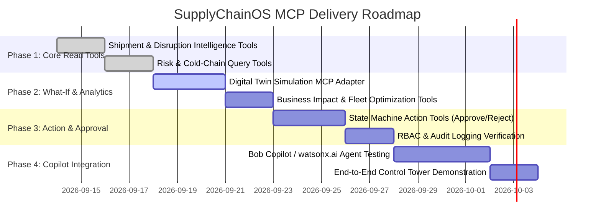

# SupplyChainOS — Model Context Protocol (MCP) Architecture

> **Document Version**: 1.0.0  
> **Status**: 📋 PLANNED (Architecture & Contract Design)  
> **Author**: Member 1 — Enterprise Software Architect  
> **Target Audience**: AI Developers, Backend Engineers, Security Architects, Hackathon Reviewers  

---

## 1. Executive Summary & Purpose

SupplyChainOS is an AI-powered supply-chain control tower designed to provide real-time visibility, disruption intelligence, predictive risk scoring, cold-chain monitoring, fleet optimization, and what-if digital twin simulations.

The **Model Context Protocol (MCP)** provides a standardized, secure JSON-RPC interface that bridges LLM assistants (specifically **Bob Copilot** / IBM watsonx.ai) with the SupplyChainOS operational backbone. Rather than allowing conversational AI models to hallucinate operational data or access the database directly, MCP exposes structured, permission-controlled, read-only and audited action tools that invoke SupplyChainOS's backend API and pure-Python business engines.

```
┌────────────────────────────────────────────────────────────────────────┐
│                              Bob Copilot                               │
│                   (Natural Language User Interface)                    │
└───────────────────────────────────┬────────────────────────────────────┘
                                    │ JSON-RPC (stdio / HTTP-SSE)
                                    ▼
┌────────────────────────────────────────────────────────────────────────┐
│                        SupplyChainOS MCP Server                        │
│                   (Protocol Adapter & Security Gate)                   │
└───────────────────────────────────┬────────────────────────────────────┘
                                    │ Internal HTTP / API Client
                                    ▼
┌────────────────────────────────────────────────────────────────────────┐
│                     SupplyChainOS FastAPI Backend                      │
│      (Routers, State Machine, Pure Python Engines, Audit Logging)      │
└───────────────────────────────────┬────────────────────────────────────┘
                                    │ SQLAlchemy ORM
                                    ▼
┌────────────────────────────────────────────────────────────────────────┐
│                         PostgreSQL 16 Database                         │
└────────────────────────────────────────────────────────────────────────┘
```

> [!IMPORTANT]
> **Implementation Status**: MCP server integration is **📋 PLANNED**. The core backend API (35+ endpoints) and all 11 pure-Python engines are **✅ IMPLEMENTED** and fully tested. This document defines the formal architectural contract for MCP implementation.

---

## 2. Why MCP is Essential for Bob Copilot

Integrating Bob Copilot via MCP provides crucial enterprise capabilities:

1. **Grounded Real-Time Intelligence**: Replaces model hallucinations with live telemetry, active disruptions, cargo temperatures, and carrier metrics retrieved directly from the verified backend.
2. **Deterministic Business Logic**: LLMs do not calculate risk scores or Haversine distances. Instead, tools invoke proven, tested engines (`DisruptionImpactEngine`, `ShipmentRiskEngine`, `PredictiveRiskEngine`).
3. **Safety & Human-in-the-Loop Governance**: High-value decisions and route changes cannot be executed autonomously by LLM agents. MCP enforces enterprise approval gates before state changes occur.
4. **Comprehensive Auditability**: Every tool call initiated by Bob Copilot logs actor identification, user prompts, reasoning chains, and resulting state transitions into PostgreSQL `audit_logs`.
5. **Decoupled Technology Stack**: Allows LLM orchestrators and client interfaces to evolve independently of backend database schemas and analytical models.

---

## 3. High-Level MCP Architecture

The SupplyChainOS MCP architecture maintains a strict, layered boundary:



### Architectural Principles

1. **No Direct DB Access**: MCP tools **never** connect directly to PostgreSQL or execute raw SQL. All data access must pass through the FastAPI REST API layer.
2. **Zero Engine Modification**: MCP adapters consume the existing public API surface. Engines remain 100% pure Python without protocol dependencies.
3. **Stateless Protocol Layer**: The MCP server is stateless; conversation state and agent memory reside within Bob Copilot, while operational state resides in PostgreSQL.
4. **Idempotent Read Operations**: All intelligence tools are strictly read-only and safe for parallel execution.
5. **Guarded Write Operations**: Mutation tools (approvals, scenario simulations) require explicit validation, permissions, and audit logging.

---

## 4. MCP Request / Response Flow



---

## 5. MCP Tool Taxonomy & Categories

The SupplyChainOS MCP server exposes **10 functional tool categories**:

| Category | Description | Primary Engine / Backend Endpoint |
|---|---|---|
| **1. Shipment Intelligence** | Live telemetry, location, status, and ETA tracking | `GET /api/v1/shipments`, `GET /api/v1/shipments/{id}` |
| **2. Disruption Intelligence** | Active disruptions, geographic epicenters, affected route codes | `GET /api/v1/disruptions`, `DisruptionImpactEngine` |
| **3. Risk Intelligence** | Deterministic risk, ML delay probabilities, feature contributions | `ShipmentRiskEngine`, `PredictiveRiskEngine` |
| **4. Cold-Chain Intelligence** | Temperature logs, excursion detection, integrity status | `ColdChainAnomalyEngine`, `GET /api/v1/shipments/{id}/temperature` |
| **5. Fleet Intelligence** | Vehicle capacity, idle/overloaded status, redeployment options | `FleetIntelligenceEngine`, `GET /api/v1/fleet` |
| **6. Route & Carrier Optimization**| Alternative routes, carrier scoring, disruption avoidance | `RouteOptimizationEngine`, `CarrierRecommendationEngine` |
| **7. Business Impact** | Value at risk, cost of delay, SLA breach exposures | `BusinessImpactEngine` |
| **8. Digital Twin Simulation** | In-memory what-if scenario simulations | `DigitalTwinEngine`, `POST /api/v1/simulation/run` |
| **9. Recommendations** | System-orchestrated actionable recommendations | `RecommendationEngine`, `GET /api/v1/recommendations` |
| **10. Approval & Governance** | Decision execution, human approval, state transitions | `POST /api/v1/recommendations/{id}/approve`, `audit_logs` |

---

## 6. Detailed Tool Specifications

### Tool 1: `get_shipment_status`
- **Category**: Shipment Intelligence
- **Type**: 👁️ Read-Only
- **Permission Required**: `operator:read`
- **Audit Required**: No
- **Purpose**: Retrieve real-time operational telemetry, location, status, and route for a specific shipment or filter list.
- **Input Schema**:
```json
{
  "type": "object",
  "properties": {
    "shipment_id": { "type": "string", "description": "Unique UUID of the shipment" },
    "tracking_number": { "type": "string", "description": "Human-readable tracking number (e.g. TRK-1001)" },
    "status": { "type": "string", "enum": ["in_transit", "delayed", "at_risk", "delivered", "pending", "cancelled"] }
  }
}
```
- **Output Schema**:
```json
{
  "shipment_id": "shp-001",
  "tracking_number": "TRK-1001",
  "status": "at_risk",
  "origin": "Shanghai Port",
  "destination": "Rotterdam Hub",
  "current_coordinates": { "lat": 14.5, "lng": 42.1 },
  "cargo_type": "temperature_sensitive",
  "cargo_value_usd": 125000.0,
  "carrier_id": "c-002",
  "route_code": "RT-SUEZ",
  "scheduled_arrival": "2026-09-18T12:00:00Z",
  "estimated_arrival": "2026-09-20T08:00:00Z"
}
```

---

### Tool 2: `get_active_disruptions`
- **Category**: Disruption Intelligence
- **Type**: 👁️ Read-Only
- **Permission Required**: `operator:read`
- **Audit Required**: No
- **Purpose**: Query currently active supply chain disruptions, severity levels, geographic zones, and blocked route codes.
- **Input Schema**:
```json
{
  "type": "object",
  "properties": {
    "severity": { "type": "string", "enum": ["low", "medium", "high", "critical"] },
    "disruption_type": { "type": "string", "enum": ["weather", "port_congestion", "geopolitical", "customs_delay", "equipment_failure", "labor_strike"] },
    "limit": { "type": "integer", "default": 20 }
  }
}
```
- **Output Schema**:
```json
{
  "disruptions": [
    {
      "id": "disp-001",
      "title": "Red Sea Shipping Security Threat",
      "disruption_type": "geopolitical",
      "severity": "critical",
      "epicenter": { "lat": 15.0, "lng": 41.5 },
      "affected_radius_km": 600.0,
      "affected_route_codes": ["RT-SUEZ", "RT-RED-SEA"],
      "affected_region": "red sea",
      "start_time": "2026-09-12T00:00:00Z",
      "status": "active"
    }
  ],
  "total_active": 1
}
```

---

### Tool 3: `get_shipment_risk`
- **Category**: Risk Intelligence
- **Type**: 👁️ Read-Only
- **Permission Required**: `operator:read`
- **Audit Required**: No
- **Purpose**: Calculate combined deterministic and ML-predicted delay risk for a shipment.
- **Input Schema**:
```json
{
  "type": "object",
  "required": ["shipment_id"],
  "properties": {
    "shipment_id": { "type": "string", "description": "Shipment UUID" }
  }
}
```
- **Output Schema**:
```json
{
  "shipment_id": "shp-001",
  "deterministic_score": 0.75,
  "deterministic_level": "high",
  "ml_predicted_delay_probability": 0.82,
  "combined_risk_score": 0.778,
  "risk_level": "high",
  "top_factors": [
    { "factor": "Critical severity disruption (+0.30)", "contribution": 0.30 },
    { "factor": "ml_days_to_scheduled_arrival", "importance": 0.28 }
  ],
  "explanation": "Shipment has high risk due to critical disruption in Red Sea and tight arrival buffer."
}
```

---

### Tool 4: `get_cold_chain_status`
- **Category**: Cold-Chain Intelligence
- **Type**: 👁️ Read-Only
- **Permission Required**: `operator:read`
- **Audit Required**: No
- **Purpose**: Check temperature logs, detect sensor excursions, and assess biological/spoilage risks for cold-chain shipments.
- **Input Schema**:
```json
{
  "type": "object",
  "required": ["shipment_id"],
  "properties": {
    "shipment_id": { "type": "string", "description": "Shipment UUID" }
  }
}
```
- **Output Schema**:
```json
{
  "shipment_id": "shp-001",
  "temperature_required": true,
  "min_temp_c": 2.0,
  "max_temp_c": 8.0,
  "latest_reading_c": 11.4,
  "excursion_detected": true,
  "excursion_duration_hours": 3.5,
  "spoilage_risk": "critical",
  "integrity_status": "compromised",
  "reading_count": 48
}
```

---

### Tool 5: `get_fleet_utilization`
- **Category**: Fleet Intelligence
- **Type**: 👁️ Read-Only
- **Permission Required**: `operator:read`
- **Audit Required**: No
- **Purpose**: Query fleet asset distribution, identify idle vs overloaded vehicles, and get nearest vehicle redeployment matches.
- **Input Schema**:
```json
{
  "type": "object",
  "properties": {
    "status": { "type": "string", "enum": ["idle", "overloaded", "all"], "default": "all" },
    "temperature_capable_only": { "type": "boolean", "default": false }
  }
}
```
- **Output Schema**:
```json
{
  "idle_count": 3,
  "overloaded_count": 1,
  "utilization_histogram": { "0-20": 3, "20-50": 5, "50-80": 8, "80-95": 4, "95-100": 1 },
  "redeployment_candidates": [
    {
      "vehicle_id": "f-004",
      "type": "refrigerated_truck",
      "utilization_pct": 10.0,
      "location": { "lat": 14.8, "lng": 42.5 },
      "capacity_kg": 12000.0
    }
  ]
}
```

---

### Tool 6: `get_recommendations`
- **Category**: Recommendations
- **Type**: 👁️ Read-Only
- **Permission Required**: `operator:read`
- **Audit Required**: No
- **Purpose**: Retrieve system-generated recommendations for active disruptions, including reroutes, carrier switches, and expedites.
- **Input Schema**:
```json
{
  "type": "object",
  "properties": {
    "status": { "type": "string", "enum": ["pending", "approved", "rejected", "deferred", "implemented"] },
    "disruption_id": { "type": "string" },
    "shipment_id": { "type": "string" },
    "priority": { "type": "string", "enum": ["low", "medium", "high", "critical"] }
  }
}
```
- **Output Schema**:
```json
{
  "recommendations": [
    {
      "id": "rec-001",
      "type": "reroute",
      "priority": "high",
      "title": "Reroute TRK-1001 via Cape of Good Hope",
      "description": "Alternative route RT-CAPE avoids Red Sea disruption.",
      "reason": "Shipment TRK-1001 is rerouted via RT-CAPE because current route is blocked by 'Red Sea Threat'.",
      "requires_approval": false,
      "estimated_savings_usd": 12500.0,
      "estimated_delay_reduction_hours": 36.0,
      "status": "pending",
      "alternative_route_id": "r-009"
    }
  ],
  "total_count": 1
}
```

---

### Tool 7: `simulate_disruption`
- **Category**: Digital Twin Simulation
- **Type**: 👁️ Read-Only (Simulation / Zero DB Mutation)
- **Permission Required**: `operator:simulate`
- **Audit Required**: Yes (Logs simulation run metadata)
- **Purpose**: Perform an in-memory what-if scenario simulation for a hypothetical or extended disruption without altering live data.
- **Input Schema**:
```json
{
  "type": "object",
  "required": ["name", "disruption_type", "severity", "epicenter_lat", "epicenter_lng", "affected_radius_km"],
  "properties": {
    "name": { "type": "string", "description": "Scenario name" },
    "disruption_type": { "type": "string", "enum": ["weather", "port_congestion", "geopolitical", "customs_delay", "equipment_failure", "labor_strike"] },
    "severity": { "type": "string", "enum": ["low", "medium", "high", "critical"] },
    "epicenter_lat": { "type": "number" },
    "epicenter_lng": { "type": "number" },
    "affected_radius_km": { "type": "number" },
    "affected_route_codes": { "type": "array", "items": { "type": "string" } },
    "horizon_hours": { "type": "number", "default": 72.0 }
  }
}
```
- **Output Schema**:
```json
{
  "scenario_name": "Extended Suez Canal Closure",
  "total_affected_shipments": 8,
  "total_secondary_shipments": 3,
  "total_cargo_value_at_risk_usd": 2450000.0,
  "total_cost_of_delay_usd": 38400.0,
  "sla_breach_count": 5,
  "penalty_exposure_usd": 25000.0,
  "recommendation_count": 12,
  "top_recommendations": [
    {
      "type": "reroute",
      "priority": "critical",
      "title": "Reroute TRK-1001 via RT-CAPE",
      "requires_approval": true
    }
  ]
}
```

---

### Tool 8: `get_business_impact`
- **Category**: Business Impact
- **Type**: 👁️ Read-Only
- **Permission Required**: `operator:read`
- **Audit Required**: No
- **Purpose**: Calculate financial exposure, cost of delay, and SLA breach penalty risks for a set of shipments.
- **Input Schema**:
```json
{
  "type": "object",
  "properties": {
    "disruption_id": { "type": "string", "description": "Filter by disruption" },
    "shipment_ids": { "type": "array", "items": { "type": "string" } }
  }
}
```
- **Output Schema**:
```json
{
  "total_cargo_value_at_risk_usd": 1850000.0,
  "total_delay_hours": 142.0,
  "avg_delay_hours": 17.75,
  "cost_of_delay_usd": 14800.0,
  "penalty_exposure_usd": 15000.0,
  "sla_breach_count": 3,
  "explanation": "8 shipments affected. Total cargo value at risk: $1,850,000. SLA breaches: 3 (penalty exposure: $15,000)."
}
```

---

### Tool 9: `approve_recommendation`
- **Category**: Approval & Governance
- **Type**: ✍️ Write / Action (State Machine Transition)
- **Permission Required**: `supervisor:approve`
- **Audit Required**: Yes (Mandatory immutable audit record)
- **Purpose**: Approve a pending recommendation to advance its state to `approved`.
- **Input Schema**:
```json
{
  "type": "object",
  "required": ["recommendation_id", "approved_by"],
  "properties": {
    "recommendation_id": { "type": "string", "description": "UUID of the recommendation" },
    "approved_by": { "type": "string", "description": "Username or ID of the human approver" },
    "reason": { "type": "string", "description": "Justification for approval" }
  }
}
```
- **Output Schema**:
```json
{
  "id": "rec-001",
  "status": "approved",
  "approved_by": "operator.jane",
  "approved_at": "2026-09-14T19:45:00Z",
  "message": "Recommendation successfully approved. Ready for implementation."
}
```

---

## 7. Read-Only vs. Write/Approval Tool Matrix

| MCP Tool Name | Classification | Target Backend Endpoint | DB State Changed? | Requires Human Actor ID? |
|---|---|---|:---:|:---:|
| `get_shipment_status` | 👁️ Read-Only | `GET /api/v1/shipments/{id}` | ❌ No | ❌ No |
| `get_active_disruptions` | 👁️ Read-Only | `GET /api/v1/disruptions` | ❌ No | ❌ No |
| `get_shipment_risk` | 👁️ Read-Only | `GET /api/v1/shipments/{id}/risk` | ❌ No | ❌ No |
| `get_cold_chain_status` | 👁️ Read-Only | `GET /api/v1/shipments/{id}/temperature`| ❌ No | ❌ No |
| `get_fleet_utilization` | 👁️ Read-Only | `GET /api/v1/fleet` | ❌ No | ❌ No |
| `get_recommendations` | 👁️ Read-Only | `GET /api/v1/recommendations` | ❌ No | ❌ No |
| `simulate_disruption` | 👁️ Read-Only* | `POST /api/v1/simulation/run` | ❌ No (Pure In-Memory) | ❌ No |
| `get_business_impact` | 👁️ Read-Only | `DisruptionImpactEngine` / `BusinessImpactEngine` | ❌ No | ❌ No |
| `approve_recommendation`| ✍️ Write/Action | `POST /api/v1/recommendations/{id}/approve` | ✅ Yes (`status='approved'`) | ✅ Yes |
| `reject_recommendation` | ✍️ Write/Action | `POST /api/v1/recommendations/{id}/reject` | ✅ Yes (`status='rejected'`) | ✅ Yes |
| `defer_recommendation`  | ✍️ Write/Action | `POST /api/v1/recommendations/{id}/defer` | ✅ Yes (`status='deferred'`) | ✅ Yes |
| `implement_recommendation`| ✍️ Write/Action | `POST /api/v1/recommendations/{id}/implement` | ✅ Yes (`status='implemented'`) | ✅ Yes |

*\*`simulate_disruption` runs the complete engine pipeline in memory and creates an audit record of the simulation request, but modifies zero shipment, route, carrier, or fleet operational data.*

---

## 8. Human-in-the-Loop & Approval Boundaries

SupplyChainOS enforces strict **Human-in-the-Loop (HITL)** governance:



### Safety Rules Enforced on MCP Tools
1. **No Autonomous Implementation**: Bob Copilot cannot invoke `approve_recommendation` or `implement_recommendation` without an explicit human actor credential and non-empty justification string.
2. **Approval Threshold Enforcement**:
   - `cargo_value_usd > $50,000.0`
   - Disruption severity is `critical`
   - Recommendation type is `expedite` or `fleet_redeploy`
   - Carrier change has `> 20%` cost increase
3. **Immutable State Transition Guards**: The state machine strictly prevents invalid transitions (e.g., cannot approve an already rejected or implemented recommendation).

---

## 9. Security, Authentication & Isolation Architecture

```
┌────────────────────────────────────────────────────────────┐
│                    MCP Security Sandbox                    │
│                                                            │
│  1. Token Validation (Bearer API Key / JWT)                │
│  2. Role-Based Access Control (RBAC)                       │
│     - Viewer: Read-only queries                            │
│     - Operator: Simulations & deferrals                    │
│     - Supervisor: Approvals & implementations              │
│  3. Pydantic Schema Validation (Type, Range, Sanitization) │
│  4. Rate Limiting & Query Scope Restrictions               │
└─────────────────────────────┬──────────────────────────────┘
                              │ HTTP + Signed Header (X-Actor-ID)
                              ▼
┌────────────────────────────────────────────────────────────┐
│                  FastAPI Backend Gateway                   │
│                                                            │
│  - Database credentials isolated from MCP server           │
│  - Raw SQL queries impossible                              │
│  - Business rules enforced in Python engines               │
└────────────────────────────────────────────────────────────┘
```

### Security Safeguards

1. **Isolation from Database**: The MCP server has no database connection string, driver, or network access to the PostgreSQL container.
2. **Actor Attribution**: All write requests through MCP require an `X-Actor-ID` and `X-Actor-Role` header which is written directly into `audit_logs`.
3. **Input Sanitization**: Geographic coordinates are clamped to valid latitude/longitude ranges (`[-90, 90]`, `[-180, 180]`), radiuses are clamped to `[1, 5000] km`, and UUID formats are strictly verified.
4. **Error Masking**: Internal exceptions and database tracebacks are caught and returned as clean, structured JSON-RPC error codes to prevent information leakage.

---

## 10. Digital Twin Simulation Safety Guarantees

The Digital Twin what-if simulation is designed with absolute operational isolation:

```
┌────────────────────────────────────────────────────────────────────────┐
│                         LIVE OPERATIONAL STATE                         │
│   Shipments: 20 active | Disruptions: 3 active | Fleet: 15 vehicles   │
└───────────────────────────────────┬────────────────────────────────────┘
                                    │ Read-Only Snapshot (Deep Copy)
                                    ▼
┌────────────────────────────────────────────────────────────────────────┐
│                     DIGITAL TWIN SIMULATION RUNNER                     │
│                                                                        │
│   Hypothetical Disruption: id = "simulation-hypothetical" (Memory Only)│
│   Recommendation Orchestrator: In-Memory Evaluation                    │
│   Cascading Engine: In-Memory Chain Evaluation                         │
│   Business Impact Engine: In-Memory Financial Calculation              │
└───────────────────────────────────┬────────────────────────────────────┘
                                    │ Pure Result
                                    ▼
┌────────────────────────────────────────────────────────────────────────┐
│                        SIMULATION RESULT OUTPUT                        │
│   (Zero live database rows updated, inserted, or deleted)              │
└────────────────────────────────────────────────────────────────────────┘
```

- **Ephemeral Entity IDs**: All simulated disruptions use prefix `simulation-hypothetical`.
- **Read-Only Engine Execution**: Engines take dictionaries and return dataclasses without side effects.
- **Zero DB Writes**: No recommendations generated during a simulation are written to the database `recommendations` table.

---

## 11. Example End-to-End User Interaction Flows

### Flow A: "Which shipments are affected by the current disruption?"


### Flow B: "What happens if this disruption lasts another 24 hours?"


### Flow C: "Which route should we use?"


### Flow D: "Approve this recommendation"


---

## 12. Implementation Roadmap & Phases



| Phase | Scope | Status | Deliverables |
|---|---|---|---|
| **Phase 1: Read-Only Intelligence** | Query tools for shipments, disruptions, cold-chain, fleet | 📋 PLANNED | `get_shipment_status`, `get_active_disruptions`, `get_shipment_risk`, `get_cold_chain_status` |
| **Phase 2: Digital Twin & Analytics** | Simulation and impact analysis tools | 📋 PLANNED | `simulate_disruption`, `get_business_impact`, `get_fleet_utilization` |
| **Phase 3: Governed Actions** | State machine approvals, human validation | 📋 PLANNED | `approve_recommendation`, `reject_recommendation`, `defer_recommendation` |
| **Phase 4: Agentic Copilot Integration** | Multi-turn watsonx.ai / Bob Copilot workflows | 🔮 FUTURE | Conversational agent, proactive alert feeds, voice control tower |

---

## 13. Verification Checklist for Future MCP Implementors

When implementing the MCP server in Phase 1:
- [ ] Connect strictly to FastAPI backend via HTTP/REST client — **NO direct database connections**.
- [ ] Use standard MCP JSON-RPC 2.0 protocol over stdio or SSE.
- [ ] Validate all tool input schemas using Pydantic models.
- [ ] Ensure all write tools require `approved_by` and write to the backend audit log.
- [ ] Verify that `simulate_disruption` leaves zero database side effects.
- [ ] Confirm all 11 business engines remain pure Python without protocol dependencies.
