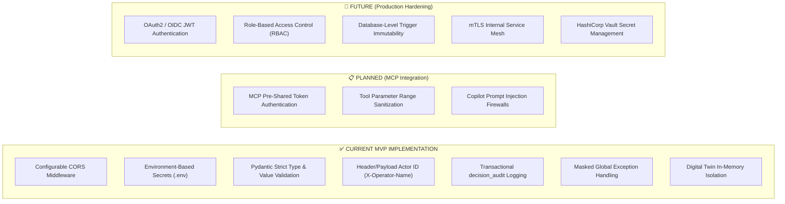
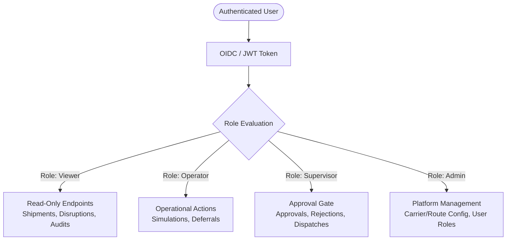
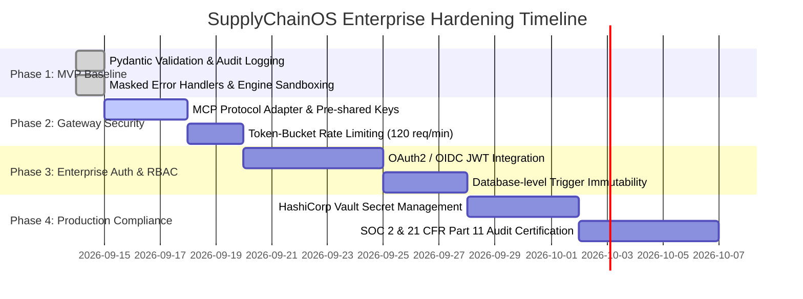

# SupplyChainOS — Security Architecture & Threat Model

> **Document Version**: 1.0.0  
> **Status**: ✅ IMPLEMENTED (MVP Controls) / 📋 PLANNED (MCP/Copilot Gateway) / 🔮 FUTURE (Enterprise Hardening)  
> **Author**: Member 1 — Enterprise Software Architect  
> **Target Audience**: Security Engineers, DevSecOps, Compliance Auditors, Platform Architects  

---

## 1. Security Objectives & Core Principles

SupplyChainOS is designed to safeguard sensitive global supply chain data, maintain operational integrity during crises, and ensure all AI-assisted decisions adhere to strict enterprise governance.

### Core Security Objectives
1. **Confidentiality**: Protect proprietary cargo values, customer tracking numbers, carrier cost structures, and route telemetry.
2. **Integrity**: Ensure risk calculations, ML predictions, and operational state transitions cannot be tampered with or bypassed.
3. **Accountability & Non-Repudiation**: Maintain an immutable, append-only audit trail attributing every approval, rejection, and simulation to a verified actor.
4. **Human Oversight**: Prevent autonomous AI agents or external scripts from executing high-stakes logistics diversions without explicit human supervisor consent.
5. **Isolation**: Prevent untrusted AI interfaces (Model Context Protocol / Bob Copilot) from directly accessing the database or modifying live state.

---

## 2. Security Zones & Architecture Boundaries

SupplyChainOS is divided into **4 distinct security zones** separated by strict communication boundaries:

```
┌────────────────────────────────────────────────────────────────────────┐
│                      ZONE 1: EXTERNAL CLIENT ZONE                      │
│        • Next.js Control Tower Dashboard (Browser Client)              │
│        • Bob Copilot (Conversational LLM Interface)                    │
└───────────────────────────────────┬────────────────────────────────────┘
                                    │ HTTPS / WSS / JSON-RPC
                                    ▼
┌────────────────────────────────────────────────────────────────────────┐
│                   ZONE 2: MCP PROTOCOL GATEWAY (PLANNED)               │
│        • Protocol Translation (JSON-RPC ↔ REST)                        │
│        • Parameter Range & Format Sanitization                         │
│        • Prompt Injection & Tool Poisoning Defense                     │
└───────────────────────────────────┬────────────────────────────────────┘
                                    │ Authenticated REST HTTP (/api/v1)
                                    ▼
┌────────────────────────────────────────────────────────────────────────┐
│                 ZONE 3: APPLICATION SERVICES ZONE (MVP)                │
│        • FastAPI Application Gateway & Router Layer                    │
│        • Pydantic Request / Response Validation                        │
│        • Approval State Machine Invariants                             │
│        • Pure Python Business Engines (Sandboxed in RAM)               │
│        • Transactional Decision Audit Logger                           │
└───────────────────────────────────┬────────────────────────────────────┘
                                    │ Async SQLAlchemy (asyncpg)
                                    ▼
┌────────────────────────────────────────────────────────────────────────┐
│                         ZONE 4: DATA PERSISTENCE                       │
│        • PostgreSQL 16 (Isolated Docker Bridge Network)                │
│        • Pre-trained RandomForest ML Artifact (Read-Only)              │
└────────────────────────────────────────────────────────────────────────┘
```

---

## 3. Current Implementation vs. Roadmap (Honest Status Baseline)

> [!IMPORTANT]
> **MVP Security Posture Statement**: The current SupplyChainOS MVP implementation focuses on architectural modularity, deterministic engine validation, and transactional audit logging. Full enterprise authentication (OAuth2/JWT) and database-level RBAC are **FUTURE** roadmap items.



---

## 4. Network Security, CORS & Ingress Boundary

### 4.1 Cross-Origin Resource Sharing (CORS)
- Configured in `backend/main.py` via FastAPI `CORSMiddleware`:
  ```python
  app.add_middleware(
      CORSMiddleware,
      allow_origins=settings.cors_origins_list,
      allow_credentials=True,
      allow_methods=["*"],
      allow_headers=["*"],
  )
  ```
- **Configuration**: Loaded from `CORS_ORIGINS` environment variable (defaults to `http://localhost:3000` for Next.js frontend). In production, wildcard origins (`*`) are strictly prohibited.

### 4.2 Database Network Isolation
- PostgreSQL runs inside an isolated Docker bridge network (`postgres_data`).
- In containerized deployments, only the `backend` service communicates with `db:5432`.
- The MCP server and frontend clients possess **zero network routes** or credentials to port `5432`.

---

## 5. Secret Management & Environment Configuration

All configuration is strictly decoupled from code via Pydantic `BaseSettings` (`backend/config.py`):

| Setting Key | Purpose | Default / Example Value | Handling & Exposure |
|---|---|---|---|
| `DATABASE_URL` | PostgreSQL connection string | `postgresql+asyncpg://supplychainOS:password@db:5432/supplychainOS` | Server-side only; never leaked |
| `WATSONX_API_KEY` | IBM watsonx.ai foundation model access | `""` (Loaded from environment) | Server-side only; never in git |
| `WATSONX_PROJECT_ID`| IBM cloud project workspace | `""` | Server-side only |
| `SLACK_WEBHOOK_URL` | Outbound alerting webhook | `""` | Server-side only |
| `APP_ENV` | Environment identifier | `"development"` (`"production"`) | Controls debug & seed behaviors |

> [!WARNING]
> In production environments, database passwords and API tokens must be injected via secure secret managers (e.g. Kubernetes Secrets, AWS Secrets Manager, or HashiCorp Vault) rather than static `.env` files.

---

## 6. Actor Identification & Human Oversight

### 6.1 Current MVP Actor Propagation (✅ IMPLEMENTED)
- **Actor Attribution**: Human operator identity is transmitted via request payload (`ApprovalAction.actor`) or HTTP header (`X-Operator-Name`).
- **Audit Logging**: Recorded directly into `decision_audit.actor` with `actor_type="human"`.
- **System Actor**: Automated background operations and initial recommendations use `actor="system"` with `actor_type="system"`.

### 6.2 Future Enterprise RBAC Model (🔮 FUTURE)



| Role | Scope | Permitted Endpoints |
|---|---|---|
| **`Viewer`** | Read-Only | `GET /shipments/*`, `GET /disruptions/*`, `GET /fleet/*`, `GET /audit/*` |
| **`Operator`** | Tactical | `POST /simulation/run`, `POST /recommendations/{id}/defer`, `POST /recommendations/generate` |
| **`Supervisor`** | Governance | `POST /recommendations/{id}/approve`, `POST /recommendations/{id}/reject`, `POST /recommendations/{id}/implement` |
| **`Admin`** | System | Reference data configuration, system settings |

---

## 7. Input Validation, Output Filtering & Error Masking

### 7.1 Input Validation & Sanitization
Every incoming request is strictly parsed and validated by Pydantic v2 schemas:
- **UUIDs**: Verified against RFC 4122 v4 format.
- **Coordinates**: Latitude clamped to `[-90.0, 90.0]`, Longitude to `[-180.0, 180.0]`.
- **Radiuses**: Disruption radiuses clamped to `[1.0, 5000.0] km`.
- **Enums**: Validated against fixed choices (`in_transit`, `delayed`, `at_risk`, `pending`, `approved`, etc.).
- **String Sanitization**: Enforces non-empty justification notes on approvals (`reason_must_not_be_empty` validator).

### 7.2 Masked Error Handling
Global exception handlers in `backend/main.py` prevent internal stack traces and database schema details from leaking to clients:

```python
@app.exception_handler(ValueError)
async def value_error_handler(request: Request, exc: ValueError) -> JSONResponse:
    return JSONResponse(status_code=400, content={"detail": str(exc)})

@app.exception_handler(Exception)
async def generic_error_handler(request: Request, exc: Exception) -> JSONResponse:
    logger.error("Unhandled exception: %s", exc, exc_info=True)
    return JSONResponse(
        status_code=500,
        content={"detail": "Internal server error"},
    )
```

---

## 8. Sandboxed Execution: Digital Twin & Pure Engines

### 8.1 Pure-Python Engine Boundary
All 11 business engines (`DisruptionImpactEngine`, `ShipmentRiskEngine`, `PredictiveRiskEngine`, etc.) are implemented in **pure Python**:
- Zero database connections.
- Zero network I/O or filesystem writes.
- Zero FastAPI or SQLAlchemy dependencies.
- Deterministic in-memory execution guarantees immunity from SQL injection and network side-channel attacks.

### 8.2 Digital Twin Simulation Sandboxing
The Digital Twin what-if scenario engine executes inside an isolated in-memory boundary:
- Uses deep copies of shipment, carrier, and route data.
- Generates ephemeral IDs (`simulation-hypothetical`).
- Commits zero rows to operational tables (`shipments`, `recommendations`, `disruptions`).
- Writes exactly one audit record with scenario parameters for traceability.

---

## 9. Machine Learning Artifact Security

The pre-trained risk prediction model (`risk_model.joblib`) is secured through architectural constraints:
1. **Module Import Load**: Loaded once during module import into read-only memory.
2. **Zero Online Retraining**: The backend does not expose any endpoint to upload, retrain, or overwrite `.joblib` files at runtime.
3. **Graceful Fallback**: If the artifact is missing, unreadable, or tampered with, `PredictiveRiskEngine` gracefully falls back to deterministic rule scoring without crashing.
4. **Deterministic Feature Extraction**: Feature inputs are strictly clamped and normalized (`[0.0, 1.0]`) in `ml/features.py` before passing to `predict_proba()`.

---

## 10. AI Agent & MCP Protocol Security Boundaries

```
┌────────────────────────────────────────────────────────────┐
│                    MCP / COPILOT THREAT MODEL              │
├───────────────────────────┬────────────────────────────────┤
│ Threat Vector             │ Defensive Countermeasure       │
├───────────────────────────┼────────────────────────────────┤
│ Indirect Prompt Injection │ Tools accept typed primitives  │
│ via carrier notes         │ (UUIDs, floats), not raw code  │
├───────────────────────────┼────────────────────────────────┤
│ Autonomous Execution      │ Mandatory human actor string;  │
│ without operator consent  │ "system" rejected on approvals │
├───────────────────────────┼────────────────────────────────┤
│ Direct Database Tampering │ MCP has no DB credentials;     │
│ or SQL injection          │ all access mediated via REST   │
├───────────────────────────┼────────────────────────────────┤
│ Hallucinated Reasoning    │ Explanations generated by pure │
│                           │ deterministic Python engines   │
└───────────────────────────┴────────────────────────────────┘
```

- **No Silent Approvals**: Bob Copilot cannot trigger state machine mutations without presenting an explicit confirmation prompt requiring human credentials and justification.
- **Protocol Sandboxing**: MCP tools communicate strictly via HTTP REST to `/api/v1` and cannot access internal engine functions directly.

---

## 11. Production Hardening Roadmap



### Future Production Checklist
- [ ] Migrate from header-based operator identification to signed OAuth2/OIDC JWT tokens.
- [ ] Implement database-level `REVOKE UPDATE, DELETE ON decision_audit` trigger rules.
- [ ] Configure mTLS between MCP Gateway, FastAPI backend, and PostgreSQL.
- [ ] Deploy token-bucket rate limiters on public and internal endpoints.
- [ ] Integrate HashiCorp Vault for dynamic database credential rotation.
- [ ] Enforce non-root user execution in Docker production images.
